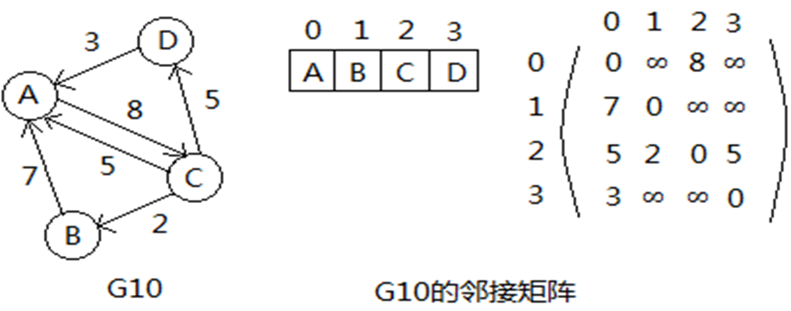
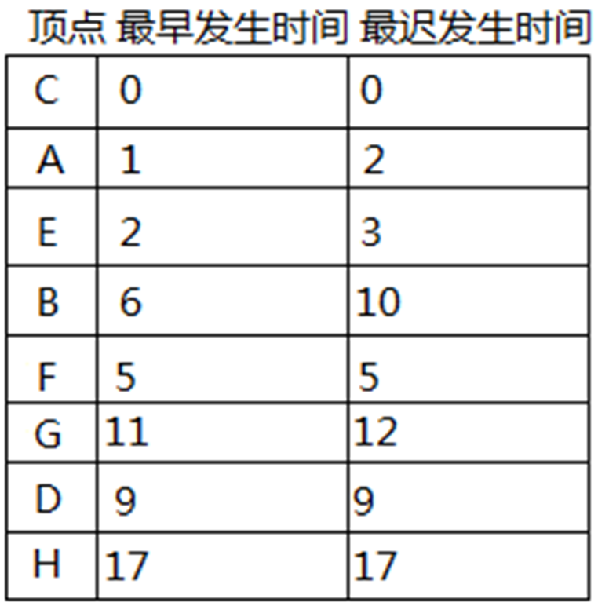

# 图

## 图的存储和操作

### 邻接矩阵

对于一个图：

1. 顶点由一个**一维数组**存储

2. 边由一个二维数组存储——**邻接矩阵**

    * 在有向图中，其邻接矩阵某一行中所有1的个数，就是相应行顶点的出度；而某一列中所有1的个数，就是相应列顶点的入度。

    * 在无向图中，某一行中所有1的个数或者某一列中所有1的个数，就是相应顶点的度。

    * 无向图中，同一条边在邻接矩阵中出现两次，无向图的邻接矩阵是以主对角线为轴对称的，主对角线全为零，因此在存储无向图时可以只存储它的上三角矩阵或下三角矩阵

    * 当图中边带有权值时，可以用**加权**邻接矩阵表示加权有向图或无向图

        * 如果顶点i至j有一条有向边且它的权值为w，可令`A[i][j]=w`；
        
        * 如果顶点i至j没有边相连，可令`A[i][j]=∞`；
        
        * 主对角线上的元素依然有`A[i][i]=0`。

    * 示例：

        

        

        

### 邻接表

对于一个图：

1. 顶点信息可以用一个一维数组来存储，这个数组称为**顶点表**, 一共有两个字段

    1. `data`: 顶点信息
    
    2. `adj`: 指向第一个邻接点的指针

2. 保存边信息的单链表称为**边表**，一共有两个字段

    1. `dest`: 该边到达（射入）的顶点的地址(在顶点表中的下标)

    2. `link`: 指向下一条边的指针

    * 对于无向图，邻接于同一个顶点的所有边形成一条单链表；
    
    * 对于有向图，自同一个顶点出发的所有边形成一条单链表

3. 示例

    * 方便计算出度，不方便计算入度

        

    * 无向图，每条边存储了2次，4条边有8个边结点。

        

    * 另外一种邻接表：顶点表不用数组，用单链表。不需要预估顶点个数，方便插入顶点。

        

**逆邻接表**：边表为**射向**同一个顶点的所有边的集合

* 方便计算入度，不方便计算出度

* 示例：

    

### 多重邻接表

在**多重邻接表**中：

1. 每条边仅使用一个结点来表示，即**只存储一次**，但这个边结点同时要在它邻接的两个顶点的边表中被链接

2. 为了方便两个边表同时链接，每个边结点不再像邻接表中那样只存储边的一个顶点，而是**存储两个顶点**

3. 每个边结点用`ver1、ver2`存储边的两个顶点，为了方便起见，不妨设`ver1<ver2`

* 示例：在这个示例中，
    * 顶点 A 连着 3 条边，
        * 取 (0, 3) 作为 A 的 `adj` 连接的第一条边，`ver1` 为 A 的下标 0，`ver2` 为 D 的下标 3，和 A 相邻的第 2 条边(0,2)对应的结点地址就存在(0,3)的 link1 字段中

        * 第 2 条边(0,2)的结点中，A 的下标 0 仍在 `ver1` 中，因此第 3 条边(0,4)对应的结点地址也存在(0,2)的 `link1` 字段中

        * 第 3 条边(0,4)对应的结点中 A 下标 0 仍在 `ver1` 中，那么第 4 条边地址也在 `link1` 中

        * 可以看出(0,4)结点中 `link1` 为 `NULL`, 说明第 4 条边不存在，这样 A 顶点的边表中就链接了 3 条边，在这条边表中，3 条边谁在前、谁在后是随意的，没有固定的顺序

    * 再看顶点 D，和 D 相邻的边有 2 条，分别是(0,3)和(1,3), 故 D 顶点的 `adj` 字段指向(0,3)

        * 因 3 在这条边结点的 `ver2` 中，因此和 D 相邻的下一条边地址存储在 `link2` 中，它指向了(1,3), 而这条边也因 3 在 `ver2` 中，因此再下一条边也在 `link2` 中

        * 如果它为空，则说明下一条边不存在了，D 的边表中一共有 2 个结点

    

无向图用多重邻接表表示时，如果要计算某个顶点的度，

* 只需要顺着这个顶点的`adj`，然后一路观察其下标在`ver1`还是`ver2`中，

* 如果在`ver1`中继续沿着`link1`数，如果在`ver2`中继续沿着`link2`数，直到遇到`nullptr`结束。

### 十字链表

在用邻接表表示有向图时，可以很方便地得出某顶点所有射出的边；而用逆邻接表表示有向图时，可以很方便地得出某顶点所有射入的边。在同一种表示中两者无法兼顾，由此提出了十字链表结构。

十字链表将邻接表和逆邻接表结合起来:

1. 在顶点表中 `firstout` 记录了该顶点第一条射出的边、`firstin`记录了该顶点第一条射入的边

2. 边结点中`v1`是弧尾、`v2`是弧头，`v1` 射向了 `v2`；

3. 边结点中`p1`指向同样由`v1`射出的边结点地址，`p2`指向同样射向`v2`的边结点地址

示例：在下图示例中，

* 顶点 `C` 射出的边有 3 条，

    * `firstout` 指向了第一条<2,0>, 
    
    * <2,0>边结点的`p1`字段指向了第二条<2,1>, 
    
    * <2,1>边结点的`p1`字段指向了第三条<2,3>, 
    
    * <2,3>边结点的`p1`字段指向了空，表示没有了。

* 顶点 `A` 射入的边有 3 条，

    * `firstin` 指向了第一条<1, 0>, 
    
    * <1,0>边结点的 `p2` 字段指向了第二条<2,0> 
    
    * <2,0>边结点的 `p2` 字段指向了第三条<3,0>, 
    
    * <3,0>边结点的 `p2` 字段指向了空，表示没有了


## 图的遍历

依照前面存储方式的讨论，无论是邻接矩阵还是邻接表存储，顶点都用一个顶点表存储，因此最简单的方式是沿着顶点表循环访问一遍，就达到了遍历的目标。这种方式，完全没有借用边的信息

两种借助边信息实现遍历的算法：深度优先遍历和广度优先遍历。

前面已经讨论过树的遍历，从某种程度上可以把图的遍历看成二叉树结构遍历的推广。

图的遍历又有其特殊性：

1. 首先图中的顶点地位相同，没有类似树结构中有一个特殊的根结点；

2. 根据边信息访问顶点时，任一顶点可能和图中多个其它顶点邻接，可能存在回路，因此在图中访问一个顶点u之后，很可能沿着其他路径再次返回顶点u。

3. 另外，对于无向图，邻接关系是相互的，（A，B）B作为A的邻接点，A又作为B的邻接点。为了避免重复访问已经访问过的顶点，在图的遍历过程中，通常对已经访问过的顶点加特殊标记。

### 深度优先遍历(DFS)

**访问方式**如下

1. 选中第一个未被访问过的顶点。

2. 访问、对顶点加已访问标志。

3. 依次从顶点的所有**未被访问过**的第一个、第二个、第三个…… 邻接顶点出发，依次进行深度优先搜索。即转向2。

4. 如果还有顶点未被访问过，选中其中一个作为起始顶点，转向2。如果所有的顶点都被访问到，结束。

**示例**：

* 图 5.15 (b) 中，
    
    * 先访问顶点 A, 然后找到一个由 A 射向的、未访问过的邻接点 C, 访问 C；

    * 由 C 找到邻接点 B, 访问 B；由 B 找到邻接点 F, 访问 F；再试图由 F 找一个由 F 射向的、未访过的邻接点，无。

    * 沿着 F 的来路回退到顶点 B, B 也再无未访问过的、由 B 射向的邻接点，再沿着 B 的来路回退到 C, 由 C 找到邻接点 D, 访问 D；由 D 找一个由 D 射向的、未访问过的邻接点，无。

    * 继续沿着来路回退到 C, C 再无未访问过且由 C 射向的邻接点，再沿着 C 的来路回退到 A, A 也再无未访问过的、由 A 射向的邻接点，回退到空，结束本棵树。

    * 此时己经访问过的顶点个数还没有达到图中顶点总数，需要在图中再找未访问过的顶点。找到了 E, 访问 E, 此时访问过的顶点个数己经达到了图中顶点总数，访问结束。

    * 顶点访问序列为 A、C、B、F、D、E

* 图 5.15 (c) 的操作是，

    * 先访问 E, 得到的一棵树，它包含了 G17中所有的顶点和部分边，是图的一个生成树。顶点访问序列为 E、C、B、F、A、D


**递归算法**

1. 访问某个顶点，然后以其第一个邻接点为起始顶点做深度优先遍历，以其第二个邻接点为起始顶点做深度优先遍历，⋯，以其最后一个邻接点为起始顶点做深度优先遍历。

2. 图可能不连通，从一个顶点开始做深度优先遍历可能只能访问到部分顶点，此时需要重新选择**尚未访问**的顶点，从它开始再次开始深度优先遍历。

3. 一个顶点可能和其他多个顶点邻接，故以它为起始顶点做深度优先遍历前需**检查**是否已经访问过。如果未访问过，遍历才能进行。

4. **算法分析**：

    * 时间复杂度：O(n+e)，其中 n 为顶点数，e 为边数

**代码实现**:

``````cpp
void Graph::DFS(int start, bool visited[]) {
    cout << verList[start].data << " ";
    visited[start] = true;
    edgeNode *p = verList[start].adj;
    while (p) {
        if (!visited[p->dest]) {
            DFS(p->dest, visited);
        }
        p = p->link;
    }
}

void Graph::DFS() {
    bool *visited = new bool[verts];
    for (int i = 0; i < verts; i++) {
        visited[i] = false;
    }
    for (int i = 0; i < verts; i++) {
        if (!visited[i]) {
            DFS(i, visited);
        }
    }
}
``````

**非递归算法**：

1. 建立一个栈，选一个顶点进栈，然后反复进行以下操作：如果栈不空，弹出访问，第一个未被访问的邻接点进栈，第二个未被访问的邻接点进栈，⋯，最后一个未被访问的邻接点进栈。

2. 对顶点表中的每个顶点，如果未被访问，以它为起始顶点做深度优先遍历。

3. **算法分析**：

    * 时间复杂度：O(n+e)，其中 n 为顶点数，e 为边数

**代码实现**：

``````cpp
template <class verType, class edgeType>
void Graph<verType, edgeType>::DFS()const
{  
    seqStack<int> s;
    edgeNode<edgeType> *p;   
    bool *visited;      
    int i, start;
 
    //为visited创建动态数组空间，并置初始访问标志为false。
    visited = new bool[verts];   
    if (!visited) throw illegalSize();

    for (i=0; i<verts; i++)  {
        visited[i]=false;
    }

    //逐一找到未被访问过顶点，做深度优先遍历
	for (i=0; i<verts; i++)
	{  
        if (visited[i]) continue;
	    s.push(i);
 	    
        while (!s.isEmpty()) {  
            start = s.top(); 
            s.pop();
            if (visited[start]) continue;
            
            cout << verList[start].data << '\t';

	        visited[start] = true;
	        p = verList[start].adj;
	        while (p) {    
                if (!visited[p->dest]) {
                    s.push(p->dest);
                }
                p = p->link;
	        }
        }
        cout << '\n';
    }
}
``````

**算法改进**：

1. 如果如果图用邻接表存储，栈可以不保存顶点，而是保存**边结点地址**。

    * 因为每个顶点射出的所有边都在各自用单链表表示的边表中，不需要把访问顶点的所有相邻顶点进栈，只需要将该顶点在边表中的一条其dest顶点未被访问的边结点地址进栈，
    
    * 它出栈时，根据边结点中link字段找下一条其dest顶点未被访问的边，如果有，将它进栈，这样便可保证同一弧尾顶点的所有邻接点可以被一个个挨着查验过去。

2. 如果图用邻接矩阵存储，

    * 访问完顶点i，可从第0列开始逐列检查，如果遇到第一个有边且顶点j未被访问过，将描述边位置的两元组(i,j)进栈；
    
    * 它出栈时，让第i行第j列后第一个有边且j+m顶点未被访问过的两元组(i,j+m)进栈即可。

3. 改进后结果：For while循环使得每条边进栈一次且仅一次，每个顶点访问一次，时间效率 O（n+e）

**改进算法实现**：

``````cpp
template <class verType, class edgeType>
void Graph<verType, edgeType>::DFS()const
{
    seqStack< edgeNode<edgeType>* > s;
    edgeNode<edgeType> *p;
    bool *visited;
    int i, start;

    visited = new bool[verts];
    if (!visited) throw illegalSize();

    for (i = 0; i < verts; i++)  {
        visited[i] = false;
    }

    for (i = 0; i < verts; i++) {
        if (visited[i]) continue;
        visited[i] = true;
        cout << verList[i].data << '\t';

        if (verList[i].adj) {
            s.push(*verList[i].adj);
        }

        while (!s.isEmpty()) {
            p = s.top();
            s.pop();

            // 保证访问完一个顶点下去的所有边
            if (p->link) {
                s.push(p->link);
            }

            if (!visited[p->dest]) {
                visited[p->dest] = true;
                cout << verList[p->dest].data << '\t';
                if (verList[p->dest].adj) {
                    // 保证为深度优先（p->dest 的邻接点）的边结点进栈
                    s.push(*verList[p->dest].adj);
                }
            }
        }
    }
}
``````

### 广度优先遍历(BFS)

**访问方式**如下：

1. 选中第一个未被访问的顶点。

2. 访问、对顶点置已访问过的标志。

3. 依次对顶点的所有未被访问过的第一个、第二个、第三个……第 m 个邻接顶点 W1 、W2、W3…… Wm 进行访问且进行标记。

4. 依次对顶点 W1 、W2、W3…… Wm 转向操作3。

5. 如果还有顶点未被访问，任选其中一个顶点作为起始顶点，转向2。如果所有的顶点都被访问到，遍历结束。

示例：


**算法**：使用队列

1. 程序首先将所有顶点的访问标志初始化为false，然后进入外层for循环。

2. 在外循环中，顺序找未被访问过的顶点作起始顶点，访问之，将起始顶点进队，然后反复执行以下循环：
    
    * 顶点出队，将它所有未被访问过的邻接点进队，访问并加访问标志，反复循环，直到队空。

3. 继续下一轮外循环，直到所有的顶点都被检查过。

4. **算法分析**：

    * 时间复杂度：O(n+e)，其中 n 为顶点数，e 为边数

**代码实现**：

``````cpp
template <class verType, class edgeType>
void Graph<verType, edgeType>::BFS()const
{
    seqQueue<int> q;
    edgeNode<edgeType> *p;
    bool *visited;
    int i, start;

    visited = new bool[verts];
    if (!visited) throw illegalSize();

    for (i = 0; i < verts; i++)  {
        visited[i] = false;
    }

    for (i = 0; i < verts; i++) {
        if (visited[i]) continue;
        cout << verList[i].data << '\t';
        visited[i] = true;
        q.enQueue(i);

        while(!q.isEmpty()) {
            start = q.front();
            q.deQueue();
            if (visited[start]) continue;
            cout << verList[start].data << '\t';
            visited[start] = true;

            p = verList[start].adj;
            while (p) {
                if (!visited[p->dest]) {
                    cout << verList[p->dest].data << '\t';
                    visited[p->dest] = true;
                    q.enQueue(p->dest);
                }
                p = p->link;
            }
        }
    }
}
``````

## 图的连通性

### 无向图的连通性

如果无向图是连通的，那么选定图中任何一个顶点，从该顶点出发，通过遍历，就能到达图中其他所有顶点。

这在以上的深度优先、广度优先遍历算法实现中增加一个**计数器**，记录外循环体中，进入内循环的次数，根据次数可以判断出该图是否连通、如果不连通有几个连通分量、每个连通分量包含哪些顶点。

**算法实现**：

``````cpp
template <class verType, class edgeType>
bool Graph<verType, edgeType>::connected()const
{
    seqQueue<int> q;
    edgeNode<edgeType> *p;
    bool *visited;
    int i, start, count = 0;

    visited = new bool[verts];
    if (!visited) throw illegalSize();

    for (i = 0; i < verts; i++)  {
        visited[i] = false;
    }

    for (i = 0; i < verts; i++) {
        if (visited[i]) continue;
        count++;  // 连通分量计数
        cout << verList[i].data << '\t';
        visited[i] = true;
        q.enQueue(i);

        while(!q.isEmpty()) {
            start = q.front();
            q.deQueue();
            if (visited[start]) continue;
            cout << verList[start].data << '\t';
            visited[start] = true;

            p = verList[start].adj;
            while (p) {
                if (!visited[p->dest]) {
                    cout << verList[p->dest].data << '\t';
                    visited[p->dest] = true;
                    q.enQueue(p->dest);
                }
                p = p->link;
            }
        }
        cout << '\n';
    }

    return count == 1;
}
``````

### 有向图的连通性

有向图的连通性和其强连通分量是同一个问题：

* 当有向图的强连通分量只有一个时，说明它是强连通图。

* 当有向图的强连通分量不止一个时，说明它不是强连通图。

有向图的强连通分量问题解决起来比较复杂：

* 对一个强连通分量来说，要求每一对顶点间都有路径可达，比如顶点i和j，不光要从i能到j，还要求从j能到i。

**算法**：

1. 对有向图 G 进行深度优先遍历，按照遍历中**回退顶点的次序**给每个顶点进行编号。最先回退的顶点的编号为1，其它顶点的编号按回退先后逐次增大1。

2. 将有向图G的所有有向边反向，构造新的有向图Gr

3. 根据步骤1对顶点进行的编号，选取**未访问**过的**最大编号**顶点。以该顶点为起始点在**有向图Gr**上进行深度优先遍历。

4. 如果没有访问到所有的顶点，则从剩余的那些未被访问过的顶点中选取编号最大的顶点，以该顶点为起始点再进行深度优先遍历，如此反复，直至所有的顶点都被访问到。

* 示例：

    

### 欧拉回路

**概念**：

1. **欧拉回路**：经过图中每条边一次且仅一次的**回路**称为欧拉回路。

2. **欧拉路径**：经过图中每条边一次且仅一次的**路径**称为欧拉路径。

3. **欧拉图**：具有欧拉回路的图称为欧拉图。

4. **半欧拉图**：具有欧拉路径但不具有欧拉回路的图称为半欧拉图。

**判定**：**欧拉定理**

1. 无向图 G 是**欧拉图**的充分必要条件是 G 是连通的且 G 中**所有顶点**的度数都是**偶数**。

2. 无向图 G 是**半欧拉图**的充分必要条件是 G 是连通的且 G 中**恰有两个顶点**的度数是**奇数**，其它顶点的度数都是偶数。

**算法**：

1. 任选一个顶点v，从该顶点出发开始深度优先搜索，搜索路径上都是由未访问过的边构成，搜索中访问这些边，最后直到回到顶点v且v**没有尚未被访问的边**，此时便得到了一个回路，此回路为当前结果回路。

2. 在搜索路径上另外找一个**尚有未访问边**的顶点，继续如上操作，找到另外一个回路，将该回路拼接在当前结果回路上，形成一个大的、新的结果回路。

3. 如果在新的结果回路中，还有中间某结点有尚未访问的边，回到2）；如果没有任何中间顶点尚余未访问的边，访问结束，当前结果回路即欧拉回路。

* 示例：

    

**算法实现**：

``````cpp
struct EulerNode {
    int NodeNum;
    EulerNode *next;
    EulerNode(int num) : NodeNum(num), next(nullptr) {}
};

template<typename verType, typename edgeType>
EulerNode *Graph<verType, edgeType>::EulerCircuit(int start, EulerNode *&end) {
    // 从start出发找到一条回到start的路径，beg为路径的起始地址，end为路径的终止地址，最终返回beg
    EulerNode *beg;
    int nextNode;
    beg = end = new EulerNode(start);
    // 从邻接表中找到从start出发回到start的一条路径
    while (this->verList[start].adj) {
        nextNode = this->verList[start].adj->dest;
        // 从邻接表中删除边
        remove(start, nextNode);
        remove(nextNode, start);
        start = nextNode;
        end->next = new EulerNode(start);
        end = end->next;
    }
    return beg;
}

template<typename verType, typename edgeType>
void Graph<verType, edgeType>::EulerCircuit(verType start) {
    EulerNode *beg, *end, *p, *q, *tBeg, *tEnd;
    int numOfDegree;
    edgeNode<edgeType> *r;
    verNode<verType, edgeType> *tmp;

    // check if the graph contains Euler circuit
    for (int i = 0; i < this->verts; i++) {
        numOfDegree = 0;
        r = this->verList[i].adj;
        while (r) {
            numOfDegree++;
            r = r->link;
        }
        if (numOfDegree % 2 || numOfDegree == 0) {
            std::cout << "No Euler circuit" << std::endl;
            return;
        }
    }

    // find the start node
    i = getVertex(start);
    if (i == -1) {
        return;
    }
    // 创建一份图的副本，用于恢复图
    tmp = clone();

    // 寻找从i出发的路径，beg为路径的起始地址，end为路径的终止地址
    beg = EulerCircuit(i, end);
    while (true) {
        p = beg;
        while (p->next) {
            // 找到一个有邻接点的顶点
            if (this->verList[p->next->NodeNum].adj) {
                break;
            } else {
                p = p->next;
            }
        }
        // 如果找不到有邻接点的顶点，说明已经找到了欧拉回路
        if (!p->next) {
            break;
        }
        q = p->next;
        tBeg = EulerCircuit(q->NodeNum, tEnd);
        tEnd->next = q->next;
        p->next = tBeg;
        delete q;
    }

    // recover the graph
    delete []this->verList;
    this->verList = tmp;

    // output the path
    std::cout << "Euler circuit: " << std::endl;
    while (beg) {
        std::cout << this->verList[beg->NodeNum].data << " ";
        p = beg;
        beg = beg->next;
        delete p;
    }
    std::cout << std::endl;
}
``````

### 六度空间理论

该理论假设世界上所有互不相识的人只需要很少的中间人就能建立起联系，具体说来就是：

* 在社会性网络中，你和世界上任何一个陌生人之间所间隔的人不会超六个，即最多通过六个人你就能够认识任何一个陌生人。

这种人际相识的关系网络(以下也称社会网络)可用数学中的无向图表示，图中顶点代表人，顶点之间的边代表人与人之间相识。

根据六度空间思想，该理论转化为无向图中任何两点之间的最短距离不会超过六，由此社会性网络就可以用图论中的最短路径问题来阐述和分析。值得一提的是，这一理论目前仍然是数学界的的一大猜想，它从来没有得到过严谨的数学证明。

下面用图论中求顶点间最短路径的方法，对六度空间理论予以验证。

验证方法：

1. 社会网络是一个对非加权无向图，一种方法是利用图的广度优先遍历算法。

    * 以图中任意一个顶点作为起始顶点，通过对图进行6层搜索，就可以统计出图中所有距离起始顶点路径长度不超过6的顶点个数，将它与图中顶点对总数进行对比，即可得出满足六度空间理论的概率来。

**算法实现**：**时间复杂度**为 $O(n+e)$

``````cpp
// 以顶点v为起始顶点，求最短距离不大于6的顶点个数和顶点总数的比值
template <class verType, class edgeType>
int  veriSixDimSpace(const Graph<verType, edgeType>  &graph, const verType &v)
{   int i, start, curVer, curLevel, count;  
    seqQueue<int> verQue, levelQue;   
    edgeNode<edgeType> *p;
    bool visited[graph.vers];
    for (int i = 0; i < verts; i++) {
       if graph.verList[i].data = v { 
           start=i; 
           break;
       } 
    }
    if (i == verts) return 0;
    for (i = 0; i < graph.verts; i++) visited[i] = false;

    count = 0;
    visited[start] = true;
    verQue.enQueue(start);
    levelQue.enQueue(0);
    
    while(!verQue.isEmpty()) {
        curVer = verQue.front();
        curLevel = levelQue.front();
        verQue.deQueue();
        levelQue.deQueue();
        count++;

        // 该顶点已经历了6个中间人，不再往下搜索
        if (curLevel > 6) continue;

        // 向curVer的下一层搜索
        p = graph.verList[curVer].adj;
        while (p) {
            if (!visited[p->dest]) {
                visited[p->dest] = true;
                verQue.enQueue(p->dest);
                levelQue.enQueue(curLevel+1);
            }
            p = p->link;
        }
    }

    return count / (graph.verts - 1);
}
``````

## AOV和AOE网

### AOV网  拓扑排序

**AOV网**: 将活动赋予顶点之上，顶点间的有向边表示活动发生的先后顺序，表达了活动之间的前后关系。 AOV网的一个典型应用是课程的先修关系。

* AOV网是一个有向无环图。

**偏序**和**全序**：

1. **偏序**：在一个集合X中，若关系R有如下特点： 关系R是自反的、反对称的、传递的，就称R是集合X上的偏序关系

2. **全序**：集合X上关系R是一个偏序关系，且对于每个a, b∈X，必有aRb或bRa，就称R是集合X上的全序关系。

**拓扑排序**：

1. 对集合X上的一个偏序关系R，通过将集合中原本不满足R关系的所有元素对人为地补充设定拥有R关系，从而将R改变为集合X上的一个全序关系，并按照此全序关系将元素排成一个线性序列。

2. **拓扑序列**：在上述线性序列$𝑎_1 、𝑎_2 、…、𝑎_𝑛$中，如果偏序关系中$𝑎_𝑖 𝑅𝑎_𝑗$，必有个$i≤j$，这个序列称为拓扑序列

3. 获得拓扑序列的排序方法称为**拓扑排序**。

**算法**：对一个有向无环图

1. 首先在图中，找到入度为0的顶点，将这些顶点全部入栈，然后反复循环判断栈是否空，非空则执行以下操作：

    * 顶点出栈，如果由该顶点射出了m条有向边，射入的这m个邻接点的入度减一

    * 如果某个邻接点的入度减为0，将该邻接点入栈

    * 重复上述操作，直到栈空

2. 示例：每个顶点旁的数字是其当前入度值，灰底顶点为进入拓扑序列的顶点

    
    

3. 注：

    * 一个AOV网的拓扑序列不一定唯一

    * 利用拓扑排序算法可以判断一个有向图是否存在有环：如果找不到入度为0的顶点，并且图中还有顶点，则说明有环

4. **算法分析**：

    * 时间复杂度: n 为顶点数，e 为边数

        * 用邻接矩阵：$O(n^2)$

        * 用邻接表：$O(n+e)$

**代码实现**：
    
``````cpp
template<typename verType, typename edgeType>
void Graph<verType, edgeType>::topoSort() const {
    int *inDegree = new int[this->verts];
    std::stack<int> s;
    int i, j;

    // 初始化入度：邻接矩阵每一列元素相加，加完入度为0的顶点入栈
    for (j = 0; j < this->verts; j++) {
        inDegree[j] = 0;
        for (i = 0; i < this->verts; i++) {
            if (this->edgeMatrix[i][j] != noEdge && i != j) {
                inDegree[j]++;
            }
        }
        if (inDegree[j] == 0) {
            s.push(j);
        }
    }

    while (!s.empty()) {
        i = s.top();
        s.pop();
        std::cout << i << " ";

        // 顶点i出栈后，将i的邻接点的入度减1，如果入度减为0，入栈
        for (j = 0; j < this->verts; j++) {
            if (this->edgeMatrix[i][j] != noEdge && i != j) {
                inDegree[j]--;
                if (inDegree[j] == 0) {
                    s.push(j);
                }
            }
        }
    }
}
``````

**应用**：

1. 确定执行任务的顺序，确保任务没有在其依赖的任务之前执行。

2. 软件开发中，分析模块之间的依赖关系。

3. 优化编译过程，确定各个阶段的执行顺序。

4. 判断图中是否存在回路。

### AOE网  关键路径

**AOE网**将**活动赋予边**之上，**顶点**表达了活动发生后到达的**某种状态或事件**。某个状态或事件既意味着前面所有的活动**结束**，也意味着后面的活动可以**开始**。AOE网的一个典型应用是工程问题。

关键子工程即**关键活动**会形成一条从总体工程开始和完工之间的路径，这条路径便是**关键路径**。

求**关键活动**的方法：

1. 求每个顶点事件的**最早发生时间**，即从**起点到达顶点**所需要的最短时间。

    * 如果一个顶点有若干条边射入，即说明该顶点表示的事件须当从起点到经由这些边到达该顶点的**全部**路径上的**活动都完成**才能发生，
    
    * 因此事件的最早发生时间是**最长路径所消耗的时间**。

    * **计算方法**：每个顶点最早发生时间是求到达它的所有路径中的最大值，故初值都设置为 0, 以后见到大者刷新它

    * 示例：

        
        

2. 求每个顶点事件的**最迟发生时间**，即从**起点到达顶点**所能容忍的最长时间。

    * 如果一个工程**终点**的**最早时间**已知，这个最早时间就是工程需要的总的最短工期
    
    * 为了达到这个工期目标，可以设定这个时间就是终点事件的**最迟发生时间**，然后对余下的顶点倒推回去，可以获得其余顶点事件的最迟发生时间。

    * 如果终点事件 B 的最迟发生时间为k, 顶点事件 A 的最迟发生时间要满足 $m = k - \max(n_1, n_2, \cdots, n_t)$, 即要保证有足够的时间完成 A、B 间**最长路径上的所有活动**

    * **计算方法**：用计算最早发生时间时顶点计算顺序的逆序来倒推计算最迟发生时间，每个顶点可以先赋予一个和终点H一样的最迟发生时间 17, 以后见到小者刷新它

    * 示例：

        
        


3. 求每个活动的**最早开始**时间，即每个**边**表示的活动最早何时能开始。

    * 对于AOE网中的一个活动<u,v>，一旦顶点u事件发生，由u射出的边<u,v>所表示的活动就可以进行了，
    
    * 因此活动<u,v>的最早发生时间是**顶点u事件的最早发生时间**。


4. 求每个活动的**最迟开始**时间，即每个**边**表示的活动最晚何时必须开始。

    * 活动<u,v>的最迟进行（发生）时间是顶点v事件的**最迟发生时间减去边<u,v>的权值**。

    * 示例：

        
        

5. 当某活动的**最早开始**时间和**最迟开始**时间相同时，这些活动便是关键活动。

    * 示例：上图中的关键活动为 <C, F>, <F, D>, <D, H>

**求关键路径**：

1. 当活动的最早发生时间和最迟发生时间一致时，表示该活动为关键活动，这些关键活动组成的由起点到终点的路径为关键路径

* 注：关键活动在最早发生时间时就必须马上开始，不得延缓

2. **算法分析**：

    * 时间复杂度：$O(n^2)$  (邻接矩阵)

**算法实现**：

``````cpp
//保存边信息
template <class edgeType>
struct keyEdge
{   int u, v;       
    edgeType weight;
    edgeType early, last;
};

template<typename verType, typename edgeType>
void Graph<verType, edgeType>::keyActivity(verType start, verType end) const {
    int *inDegree = new int[this->verts];
    edgeType *verEarly, *verLast;  // 事件-顶点的最早发生时间、最迟发生时间
    keyEdge<edgeType> *edgeEL;  // 记录每个活动-边的最早发生时间、最迟发生时间
    std::stack<int> s1;  // s1保存入度为0的顶点
    std::stack<int> s2;  // s2保存确定顶点最早发生时间的顶点顺序
    int i, j, k;
    int u, v;
    int intStart, intEnd;

    verEarly = new edgeType[this->verts];
    verLast = new edgeType[this->verts];
    edgeEL = new keyEdge<edgeType>[this->edges];

    // 找到起点和终点的下标
    intStart = intEnd = -1;
    for (i = 0; i < this->verts; i++) {
        if (this->verList[i] == start) {
            intStart = i;
        }
        if (this->verList[i] == end) {
            intEnd = i;
        }
    }
    if (intStart == -1 || intEnd == -1) {
        throw outOfBound();
    }

    // 计算每个顶点的入度: 邻接矩阵每一列有边的元素个数相加
    for (j = 0; j < this->verts; j++) {
        inDegree[j] = 0;
        for (i = 0; i < this->verts; i++) {
            if (this->edgeMatrix[i][j] != noEdge && i != j) {
                inDegree[j]++;
            }
        }
    }

    // 初始化 顶点 最早发生时间
    for (i = 0; i < this->verts; i++) {
        verEarly[i] = 0;
    }

    // 计算每个顶点的最早发生时间
    // 初始化 起点 的最早发生时间
    verEarly[intStart] = 0;
    i = intStart;
    s2.push(i);  // 起点入栈s2

    // 计算其他顶点的最早发生时间
    // 当终点因为入度为零压栈、出栈时，计算结束
    while (i != intEnd) {
        for (j = 0; j < this->verts; j++) {
            if (this->edgeMatrix[i][j] != noEdge && i != j) {
                inDegree[j]--;
                // 入度为0的顶点入栈s1
                if (inDegree[j] == 0) {
                    s1.push(j);
                }
                if (verEarly[j] < verEarly[i] + this->edgeMatrix[i][j]) {
                    verEarly[j] = verEarly[i] + this->edgeMatrix[i][j];
                }
            }
        }

        i = s1.top();
        s1.pop();
        s2.push(i);  // 确定了顶点i的最早发生时间（入度已经为0），入栈s2
    }

    // 初始化顶点最迟发生时间
    for (i = 0; i < this->verts; i++) {
        verLast[i] = verEarly[intEnd];
    }

    // 按照计算顶点最早发生时间逆序依次计算顶点最迟发生时间
    while (!s2.empty()) {
        j = s2.top();
        s2.pop();

        // 修改所有射入顶点j的边的箭尾顶点的最迟发生时间
        for (i = 0; i < this->verts; i++) {
            if (this->edgeMatrix[i][j] != noEdge && i != j) {
                if (verLast[i] > verLast[j] - this->edgeMatrix[i][j]) {
                    verLast[i] = verLast[j] - this->edgeMatrix[i][j];
                }
            }
        }
    }

    // 建立边信息数组
    k = 0;
    for (i = 0; i < this->verts; i++) {
        for (j = 0; j < this->verts; j++) {
            if (this->edgeMatrix[i][j] != noEdge && i != j) {
                edgeEL[k].u = i;
                edgeEL[k].v = j;
                edgeEL[k].weight = this->edgeMatrix[i][j];
                k++;
            }
        }
    }

    // 将边的最早发生时间<u,v>设置为: 箭尾顶点u的最早发生时间
    // 将边的最迟发生时间<u,v>设置为: 箭头顶点v的最迟发生时间 - <u,v>边的权重
    for (k = 0; k < this->edges; k++) {
        u = edgeEL[k].u;
        v = edgeEL[k].v;
        edgeEL[k].early = verEarly[u];
        edgeEL[k].last = verLast[v] - edgeEL[k].weight;
    }

    // 输出关键活动
    std::cout << "The key activities are: " << std::endl;
    for (k = 0; k < this->edges; k++) {
        if (edgeEL[k].early == edgeEL[k].last) {
            u = edgeEL[k].u;
            v = edgeEL[k].v;
            std::cout << this->verList[u] << " -> " << this->verList[v] << std::endl;
            std::cout << "Early time: " << edgeEL[k].early << " Last time: " << edgeEL[k].last << std::endl;
            std::cout << std::endl << std::endl;
        }
    }
}
``````

## 最小代价生成树

### 定义

当一个**无向图**中每条边有一个权值（如：长度、时间、代价等），这个图通常称为**网络**。如果这个无向图是连通的，且其子图满足以下4个条件：

1. 包含原来网络中的所有顶点

2. 包含原来网络中的部分边

3. 该子图是连通的

4. 在同时满足1）、2）、3)条件的所有子图中该子图所有边的权值之和最小

该子图就被称为**最小代价生成树**( Minimum Cost Spanning Tree)。

### Prim算法

**Prim算法**着眼于顶点：对一个无向连通图G = { V, E }，用W表示顶点集合、U表示最小生成树中顶点集合、T表示最小生成树中边集合

示例：在 W 中任选一个顶点，这里选择了 A。

* 将 A 从 W 中移到 U 中，于是 W 中所有 A 的相邻顶点的 tag 值获得刷新机会：

    * C 因(A,C)由无穷刷新为 5, 
    
    * E 因(A,E)由无穷刷新为 1, 
    
    * D 因(A,D)由无穷刷新为 1, 
    
    * B 因(A,B)由无穷刷新为 3, 
    
    * 且这些顶点的源头结点都记为 0 (即 A 顶点)，
    
    * 图 5-20中顶点旁的数字及字母分别是其 tag 值和源头顶点。
    
* 从W中选取 tag 最小的顶点，这里可以是 E、D, 任选其中一个，如选择 E, 将 E 移入 U 中，并将边(A,E)移入集合 T 继续刷新 W 中所有和 E 相邻的顶点的 tag 值，

    * 结果 C 因(E,0)由 5 刷新为 3, 源头结点记为 4 (即(E))。
    
* 继续反复循环：在 W 中找最小 tag 值、从 W 移顶点到 U、将边并入 T 刷新相邻顶点 tag 值，最终得到结果如图 5-20(f) 所示，此时便得到了一个最小代价生成树，且最小生成树中边的权值和为 8


**性能分析**：

* Prim算法的时间复杂度为 $O(n^2)$，如果在查找最小 tag 值的过程中使用最小堆，时间复杂度可降为 $O(n\log n)$

### Kruskal算法

**Kruskal算法**着眼于边：每次找权值最小的边，以权值最小的边是否在已选择边形成的图中造成回路来判断它是否能加入最小代价生成树

**算法思想**：对于一个无向连通图G={V, E}，其中V是顶点的集合，E是边的集合

1. 算法开始时，令最小代价生成树MST＝{V,φ}，此时MST仅由图G的n个顶点构成，MST不包含图G的任何一条边，这n个顶点各自构成一个连通分量，共计n个连通分量

2. 在图G中选择权值最小的边，如果该边加入MST后会使已有的图形成回路则放弃该边，转而选择权值次小的边，否则将其并入MST

    * 判断是否形成回路：加入一个连通分量标志，如果两个顶点在同一个连通分量（连通标志相同）中，那么放弃该边；否则MST中加入该边，并将两个连通分量合并为一个连通分量

3. 反复循环，直到MST中边的条数达到n-1时停止

示例：


**性能分析**：

1. 求最小权值的便可以借助最小化堆来实现：如果图中边的条数为e，建堆的时间代价为$O(e)$；找最小边即从堆中删除一个根结点，时间代价是$O(log_2⁡𝑒)$

2. 当找到最小边后需要检查边的两个连通分量标志，如果不在一个连通分量里面，才可以加入，检查的时间代价是$O(1)$，两个连通分量的合并时间为$O(n)$。

3. 尽管最小生成树中只含有n-1条边，但可能要检查到所有的边，所有边都可能从堆中作为最小值被删除，其中n-1条边的加入都需要修改顶点的连通分量标志

4. 所以总的时间是：$O(e) +O((n−1)log_2⁡𝑒))+ O(𝑛^2)$。**时间复杂度**为 $O(𝑛^2)$。

## 最短路径

### 单源最短路径（Dijkstra算法）

**单源最短路径**问题：给定一个有向图G = {V, E}，其中V是顶点的集合，E是边的集合，每条边的权值为非负值，要求找出从源点出发到达其它各个顶点的最短路径，即到达各个顶点时所经过的路径上各条边的**权值之和最小**

**Dijkstra算法**：

1. 每个顶点设置一个距离标签，标识源点到该顶点的最短距离；设置一个顶点集合S，作为已经确定最短路径的顶点集合。

2. 初始时，S置为空且将每个顶点到源点的距离标签置为无穷大。

3. 将源点放入S中，源点的距离标签设置为0，现在以源点作为当前顶点，循环做以下操作：

    1. 沿当前顶点射出的各条边找到其每个邻接点，如有邻接点A，如果**当前顶点**的**距离标签**加上其到达顶点A的**边的权值**小于顶点A上的距离标签，则用当前顶点的距离标签加上边的权值刷新顶点A上的距离标签

    2. 在V-S集合中找到距离标签**最小**的顶点，将该顶点放入S中，并以它为当前顶点，再次进入循环

    3. 当所有顶点都进入S时，循环结束。每个顶点上的距离标签即源点到这个顶点的最短距离

* Dijikstra算法是一个贪心算法。算法正确的条件是边上不带负的权值

* 假如图中边无权值，最短路径一般定义为路径上经过的边的条数最少

    * 一个方法是将每一条边的权值都视作1，用上述的Dijkstra 算法就可以求出；

    * 另外一种方法是从源点出发，使用广度优先遍历的方法遍历顶点，顶点遍历时就是其获得最短距离的机会，其最短距离为遍历时其直接前驱顶点的最短距离加1。

* **时间复杂度**：$O(n^2)$


示例：


### 顶点对间最短路径（Floyd算法）

**顶点对间最短距离**：任意两个顶点之间的最短路径

**Floyd算法**：

1. 对任意两个顶点对<i,j>，在顶点对之间增加另外一个顶点k，观察增加后的路径i-k-j距离是否比原本i到j间的距离更小
    
    * 如果是，就用新的路径、距离替代原本两个顶点间的路径、距离

* 示例：图 G_24用邻接矩阵表示，当用 dist<i, k>+ dist<k, j>刷新 dist<i, j>时，用一个二维数组`pre`记录下 k ,表示目前 i 到 j 之间的最小距离是以 k 为中介点的

    1. 初始时，pre 数组全部赋值为-1, 将邻接矩阵复制到矩阵A, 然后对 A 中各个元素进行以下迭代刷新：

    2. 先对 A 中各元素加入顶点 0。注意加。顶点时，不需要考虑第 0 行和第 0 列中的所有元素,只需要考虑 A 中的元素 $a_{12}, a_{13}, a_{21}, a_{23}, a_{31}, a_{32}$

        * $a_{12}$: 因为 $a_{10} + a_{02} = \infty + \infty$，所以 $a_{12}$ 保持不变

        * $a_{13}$: 因为 $a_{10} + a_{03} = \infty + \infty$，所以 $a_{13}$ 保持不变

        * $a_{21}$: 因为 $a_{20} + a_{01} = 4 + 1 = 5$，所以 $a_{21}$ 刷新为 5......以此类推

        * 两个元素 $a_{21}、 a_{31}$在加顶点 0 后, 得到刷新, 所以 `pre[2][1]`和 `pre[3][1]`都置为 0, 表示现在<2,1>、<3,1>间的最短距离是因为顶点 0 的介入造成的

    3. 用类似的方法对图 5.24 (c) 中的矩阵考虑加入顶点 1、2、3并刷新pre，计算完毕

    4. 此时，矩阵 A 中的元素`a[i][j]`的值就是顶点 i 到顶点 j 的最短距离，`pre[i][j]` 的值就是顶点 i 到顶点 j 的最短路径上的中介点

        * 如：2->3 的最短路径是 2-0-1-3
        
            * `pre[2][3] = 1: a[2][3] = a[2][1] + a[1][3]`
            
            * `pre[2][1] = 0: a[2][3] = a[2][0] + a[0][1] + a[1][3]`

            * `pre[2][0] = -1, pre[0][1] = -1, pre[1][3] = -1: a[2][3] = a[2][0] + a[0][1] + a[1][3]`

        

**算法分析**：

* **时间复杂度**：$O(n^3)$，主要取决于迭代计算数组A

    * 和将各个顶点逐次作为源点，多次调用求单源最短路径的Dijkstra算法的时间代价是一样的，但是Floyd算法形式上更简单些

* Dijkstra算法不支持边上带有负权值的情况。Floyd算法可以允许带有负权值的边，但不允许出现**带有负权值的边出现在回路且回路中各边的和为负值**的情况。

    * 反复绕带负权值边且各边和为负值的回路多次，路径距离会越来越短，没有尽头

    
    