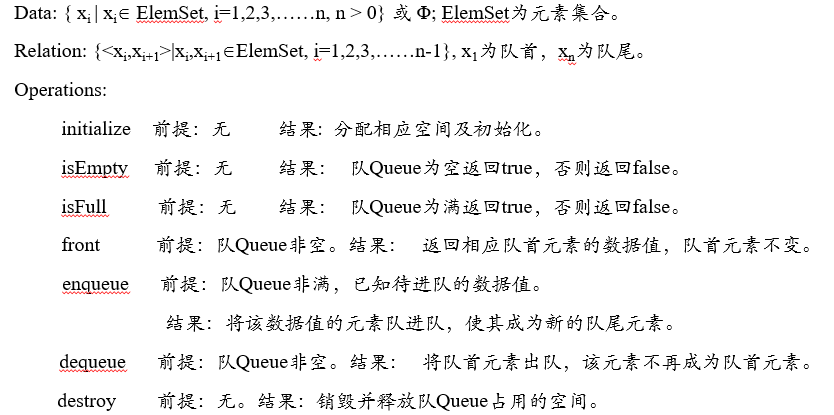
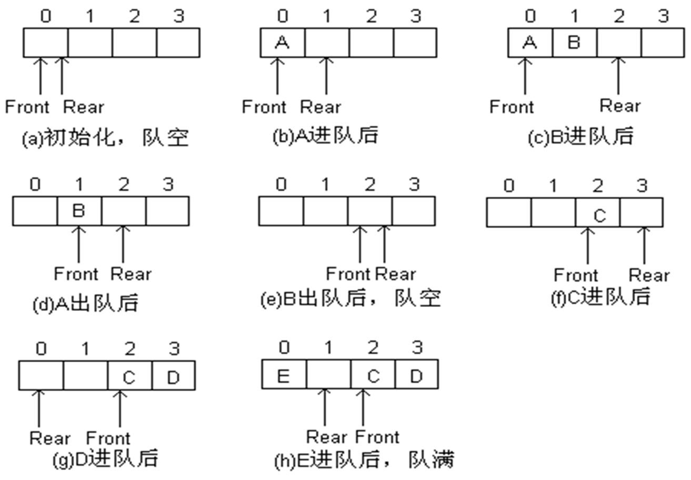

# 队列

## 定义

如果元素到达线性结构的时间越早，离开的时间就越早，这种线性结构称为**队（Queue）**或者**队列**。

队列是一种先进先出（First In First Out，FIFO）的线性表，只允许在表的一端进行插入，而在另一端进行删除。

元素从队首删除的操作，称为出队（deQueue）；元素在队尾位置插入的操作，称为进队（enQueue）

**ADT**：

## 顺序队列

**定义**：用一组连续的空间存储队列中的元素及元素间关系，这样存储的队列称顺序队列

* 队列中的元素个数最多为 maxSize个，其下标的范围从0到maxSize-1。
   
* 使用队首指针Front指示队首元素，使用队尾指针Rear指示队尾元素，便于出队进队操作

* 判断队空和队满——使用**顺序循环队列**

**顺序循环队列**：让 Front 指向真正的队首元素，Rear 指向真正存放队尾元素的后一数组单元

* 队空标志：Front == Rear

* 队满标志：(Rear+1) % maxSize == Front

* 队列中元素个数：(Rear-Front+maxSize) % maxSize

* 进队、出队时，队尾指针Rear和队首指针Front的变化规律：

    * 进队：Rear = (Rear+1) % maxSize
    
    * 出队：Front = (Front+1) % maxSize

* 示例：

    

## 链队列

**定义**：用链表存储队列中的元素及元素间关系，这样存储的队列称链队列

* 队首指针Front指向链队列的队首结点，队尾指针Rear指向链队列的队尾结点

* 队空条件：Front == Rear == NULL

## 优先队列

**顺序优先队列**:

1. 进队按时间顺序存放，出队是优先级高者出队。

    1. 进队时，按照下标由小到大的顺序即直接将元素放队尾，时间为O(1)

    2. 出队时，从所有元素中找到优先级最高的元素，然后删除，查找最高优先级元素时间为O(n)

    3. 设队尾Rear指针指向实际队尾元素的后一单元。
        
        * 则队空的条件为：Rear = 0;
        
        * 队满的条件为：Rear = maxSize

2. 进队按优先级顺序存放，出队是队首出队。

    1. 元素进队时，先在队列中找到合适的插入位置，移动后面的元素，将新进元素插入，时间复杂度为O(n)

    2. 出队时，删除队首即0下标元素即可，为了避免后面元素的移动，可以采用顺序循环队列，时间复杂度为O(1)

    3. 设队尾Rear指针指向实际队尾元素的后一单元。
        
        * 则队空的条件为：Rear == Front;  

        * 队满的条件为：(Rear+1）%maxSize == Front

**链式优先队列**：

1. 进队按时间顺序存放，出队是优先级高者出队：与顺序优先队列类似，只是用链表存储

2. 进队按优先级顺序存放，出队是队首出队：

    * 元素出队即删除首结点，时间复杂度为O(1)；
    
    * 元素进队，需要按照优先级大小找到合适的插入位置，然后插入元素结点，时间复杂度为O(n)，但不会引起队列中原有元素在内存中移动
