# 查找

## 静态查找

### 顺序查找

把0下标位置设置成一个哨兵位，当要查找数据x时，首先将x存入哨兵位，然后从n下标开始向前一直找到0下标。

假设下标m的数据是要查找的x，则当m大于0时，表示查找成功；m等于0时，表示查找不成功。

加哨兵位的好处是避免了逐个检查数组元素时还要首先检测下标是否越界，用浪费一个空间的方式换取时间，提高了效率。

无论查找成功与否，时间复杂度均为$O(n)$

### 二分查找(折半查找)

元素序列有序时，可以使用二分查找。

首先比较中间位置元素，比较成功，查找结束；

比较不成功，如果待查找元素小于中间位置元素，在前半段使用上述同样方法继续查找。

特殊地，如果前半段没有了，即长度为0，说明不存在待查找元素；如果待查找元素大于中间位置元素，在后半段使用上述同样方法继续查找。特殊地，如果后半段没有了，也说明不存在待查找元素。

算法时间复杂度为$O(\log_2n)$

### 插值查找

插值查找是根据待查元素值和两个端点即最大最小元素值的距离来计算或估算下次查找的位置

插值查找的条件是：不仅数据是有序的，而且这组数据值的分布是均匀的。

### 分块查找

分块查找是把一个大的线性表分解成若干块，块中数据可以无序，任意存放，但块间必须有序。

要建立一个索引表，把每块中最大关键字值作为索引表的关键字，从小到大顺序存放在一个辅助数组中。查找时，可以先在索引表中折半查找，确定要找的元素所在的块，然后在块中采用顺序查找，即可找到对应的元素

一般适用于数据量很大，无法一次调入内存的情况。

特别适合于元素动态变化的情况。当增加或减少元素时，只需将该元素调整到所在的块即可。

## 动态查找

### 二叉查找树

定义：对二叉树中的每个结点而言，其左子树上的所有结点都比它小，其右子树上的所有结点都比它大。

#### **查找**

1. 递归方法：
    * 如果根结点为空，查找失败
    * 否则和根节点比较：
        - 如果等于根节点，查找成功
        - 如果小于根节点，递归查找左子树
        - 如果大于根节点，递归查找右子树
2. 非递归方法：
    * 以根为当前节点
    * 如果当前节点为空，查找失败
    * 否则和当前节点比较：
        - 如果等于当前节点，查找成功
        - 如果小于当前节点，当前节点指向左子树
        - 如果大于当前节点，当前节点指向右子树
    * 直到当前节点为空
3. 时间复杂度：$O(h)$，h为树的高度

#### **插入**

1. 递归方法：
    * 如果根结点为空，插入新结点
    * 否则和根节点比较：
        - 如果等于根节点，则无需插入
        - 如果小于根节点值，递归插入左子树
        - 如果大于根节点值，递归插入右子树
    * 代码：
    ``````cpp
    void binarySearchTree<elemType>::insert(const elemType &x, Node<elemType> *&t)
    {   
        if (!t) { t = new Node<elemType>(x); return; }
        if (x == t->data) return; //已存在，结束插入
        if (x < t->data)
            insert(x, t->left);
        else
            insert(x, t->right);
    }
    ``````
    * 注：这里的 **t** 用了**引用**形式，这样才能完成新节点的父子关联
2. 非递归方法：
    1. 方法一：
        * 如果根为空，创建新节点作为根
        * 如果根不为空，设置当前节点为根结点，将待插入元素与当前节点比较：
            - 如果等于当前节点，无需插入
            - 如果小于当前节点且当前结点无左子，插入新节点；否则，当前节点指向左子树
            - 如果大于当前节点且当前结点无右子，插入新节点；否则，当前节点指向右子树
        * 直到当前节点为空，插入新节点
    2. 方法二：
        * 设置一个父节点指针，和父子类型参数 flag(0表示左子，1表示右子)
        * 设置当前节点为根结点，父节点指针为空
        * 反复进行以下操作，直到当前节点为空：
            - 待插入元素与当前节点比较，如果等于当前节点，无需插入
            - 如果小于当前节点，父节点指针指向当前节点，当前节点指向左子树
            - 如果大于当前节点，父节点指针指向当前节点，当前节点指向右子树
        * 创建新节点
            - 若父节点为空，新节点为根
            - 若 flag 为 0，新节点为父节点的左子
            - 若 flag 为 1，新节点为父节点的右子
3. 时间复杂度：$O(h)$，h为树的高度

#### **删除**

1. 思想：
    1. 如果根为空，删除结束
    2. 否则和根节点比较：
        - 如果等于根节点，则实施删除操作
        - 如果小于根节点，在其左子树中继续删除
        - 如果大于根节点，在其右子树中继续删除
    3. 三种删除操作
        * 待删除结点为叶子结点，直接删除，父子链置为空
        * 待删除结点只有一个子结点，用唯一子结点替换待删除结点，释放待删除结点
        * 待删除结点有两个子结点，在右子树中找到最左侧（最小）结点，用该结点替换待删除结点，删除最左侧结点
2. 递归实现：
    * 代码：
    ``````cpp
    void binarySearchTree<elemType>::remove(const elemType &x, Node<elemType> *&t)
    {
        if (!t) return;
        if (x < t->data) remove(x, t->left);
        else if (x > t->data) remove(x, t->right);
        else if (t->left && t->right) //有两个子结点
        {
            Node<elemType> *tmp = t->right;
            while (tmp->left) tmp = tmp->left;
            t->data = tmp->data;
            remove(t->data, t->right);
        }
        else if (!t->left && !t->right) //叶子结点
        {
            delete t;
            t = nullptr;
        }
        else //有一个或无子结点
        {
            Node<elemType> *oldNode = t;
            t = (t->left) ? t->left : t->right;
            delete oldNode;
        }
    }
    ``````
    * t 引用形式的作用：
        - 删除叶子时，`t=NULL`, 就完成了将父结点对应的孩子字段置为空
        - 删除只有一个孩子的结点时， `t = (t->left)? t->left : t->right`;  据将唯一的孩子链到了待删除结点的父结点对应的孩子链上。
        - 删除有两个孩子的结点时， `remove(substitute->data, t->right)`; 保持递归调用时前后两次的参数引用关系。
3. 非递归实现：
    * 由根向下查找，每层有一个结点参与。
    * 用 p 指向当前结点，parent 指向其父结点。父一路跟随其子下行，并随时修改 flag 标志以记忆当前父子关系是顺左分支还是右分支
    * 根据 parent 和 flag 完成对父结点孩子字段的修改任务（依旧同上述删除的三种情况）
    * 时间复杂度：最多为树高的两倍

二叉查找树的查找、插入、删除时间复杂度均为二叉树的高度。如果该二叉树形态极端，是单支树，即每个结点只有一个孩子，二叉树的高度都是结点的个数，时间复杂度都达到O(n) 。因此，二叉查找树的性能取决于树的形态，为了避免极端情况，引入平衡二叉树。

### 平衡二叉树

**定义**：
1. 平衡因子：一个结点的平衡因子 = 其左子树的高度 - 其右子树的高度
2. 平衡二叉树：任意结点的平衡因子的绝对值不超过1的二叉查找树
* 注：平衡二叉查找树并不能直接和树高最矮划等号，但平衡二叉查找树已经接近于最矮

#### 插入

当元素插入到AVL树中时，就可能打破原有的平衡。

新插入结点的平衡因子为0，一路自下而上往祖先结点传导。
* 如果传导来自于左子树，说明左子树高度增加了1，父结点平衡因子加1
* 如果传导来自于右子树，说明右子树高度增加了1，父结点平衡因子减1

父结点平衡因子变化后，如果结果：
* 为**0**，以父结点为根的子树高度没有变化，自下而上的传导行为**停止**
* 为**非0**，依然按照传导来自左子树加1、右子树减1的原则向祖父结点传导，**直到**某一层祖先结点的平衡因子变为**0**或者到达**根**结点

AVL树中的**冲突结点**：
* 在向上的传导过程中，平衡因子第一个超过-1，0，1范围的结点称为冲突结点
* 一旦发现冲突结点，暂停沿祖先向上的传导，先对二叉树在冲突结点附近实施调整，直到它变得平衡。

**冲突结点的调整**：冲突结点（A）和来自插入方向的子结点（B）、孙子结点关系分4种类型:
1. LL型：左子树高，在左(L)孩子的左(L)子树上添加结点
    * 做一次上臂右旋: 把冲突结点 A 的左孩子 B 提升为新的根结点，A 作为 B 的右孩子，B 的右孩子作为 A 的左孩子
    * 图示：
    
        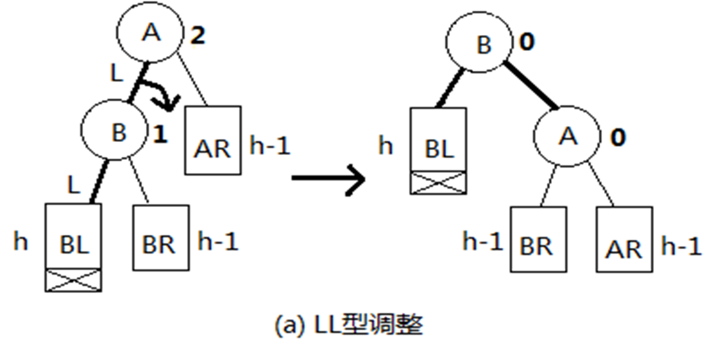

2. RR型：右子树高，在右(R)孩子的右(R)子树上添加结点
    * 做一次上臂左旋: 把冲突结点 A 的右孩子 B 提升为新的根结点，A 作为 B 的左孩子，B 的左孩子作为 A 的右孩子
    * 图示：
    
        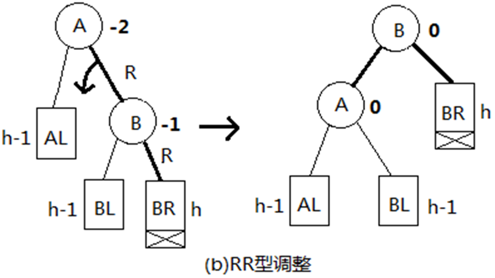
    
3. LR型：左子树高，在左(L)孩子的右(R)子树上添加结点，一共有三种形态
    1. LR0型：左子树的右孩子平衡因子为0
        * 先进行一次下臂左旋变成LL型，再对进行一次上臂右旋：先把冲突节点B的右孩子 C 提升至 A 的左孩子，把 B 作为 C 的左孩子，C 的左孩子作为 B 的右孩子；再把冲突结点 A 的现在的左孩子 C 提升为新的根结点，A 作为 C 的右孩子，C 的右孩子作为 A 的左孩子
        * 图示：
        
            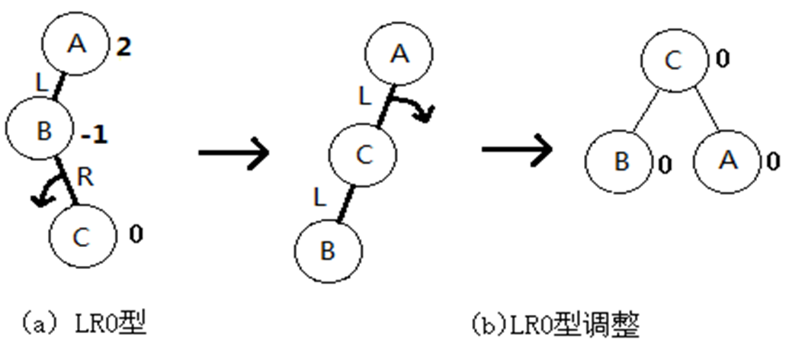
    2. LR1型：左子树的右孩子平衡因子为1
        * 一次下臂左旋变成LL型，在进行一次上臂右旋：同LR0型，调整后结点 A 的平衡因子为-1，B 的平衡因子为0
        * 图示：
        
            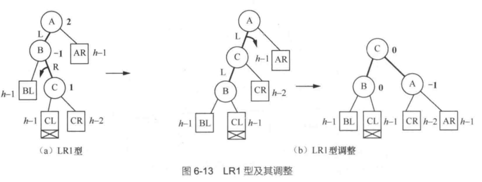
    3. LR2型：左子树的右孩子平衡因子为-1
        * 一次下臂右旋变成LL型，在进行一次上臂右旋：同LR0型，调整后结点 A 的平衡因子为0，B 的平衡因子为1
        * 图示：
        
            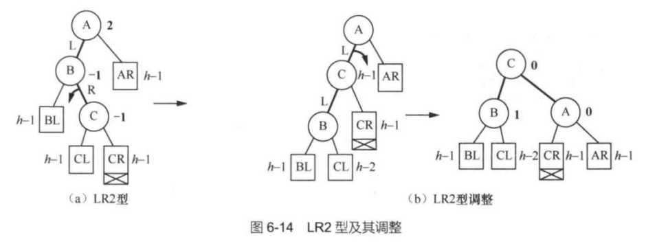

4. RL型：右子树高，在右(R)孩子的左(L)子树上添加结点
    * 同样的三种形态，分别为RL0型、RL1型、RL2型
    * 调整操作均为：先进行一次下臂右旋变成RR型，再对进行一次上臂左旋
    * 不同的是，调整后局部根的左右子平衡因子不同：
        * RL0：均为0
        * RL1：左子为0，右子为-1
        * RL2：左子为1，右子为0
    * 图示：

        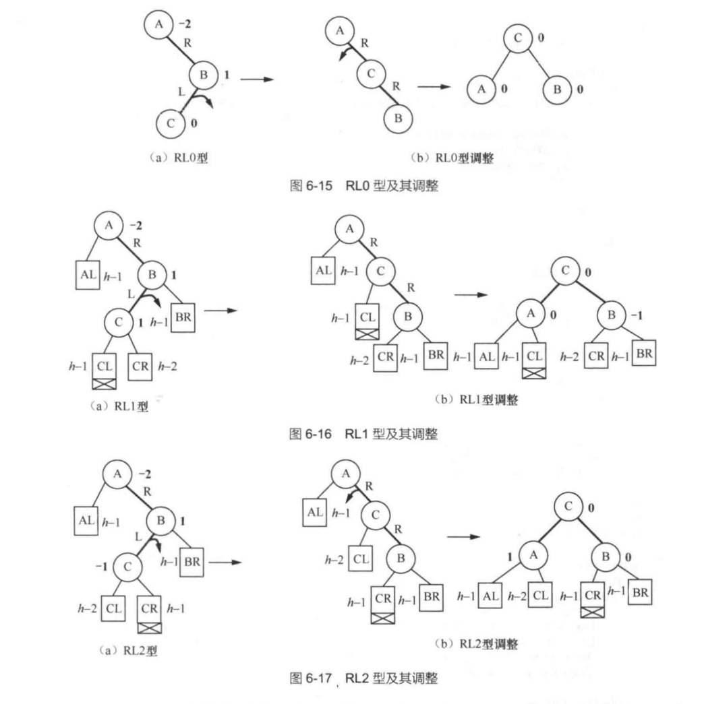

5. 代码实现：
    插入函数中，插入后递归调整平衡因子，如果发现冲突结点，调用相应的旋转函数
    ``````cpp
    void insert(const elemType &x, Node<elemType> *&t)
    {
        if (!t) { t = new Node<elemType>(x); return; }
        if (x == t->data) return;
        if (x < t->data)
        {
            insert(x, t->left);
            if (height(t->left) - height(t->right) == 2)
                if (x < t->left->data) LL(t);
                else LR(t);
        }
        else
        {
            insert(x, t->right);
            if (height(t->right) - height(t->left) == 2)
                if (x > t->right->data) RR(t);
                else RL(t);
        }
        t->height = max(height(t->left), height(t->right)) + 1;
    }
    ``````
    * 旋转函数：
    ``````cpp
    void LL(Node<elemType> *&t)
    {
        Node<elemType> *tmp = t->left;
        t->left = tmp->right;
        tmp->right = t;
        // 更新高度
        t->height = max(height(t->left), height(t->right)) + 1;
        tmp->height = max(height(tmp->left), height(tmp->right)) + 1;
        t = tmp;
    }
    
    void RR(Node<elemType> *&t)
    {
        Node<elemType> *tmp = t->right;
        t->right = tmp->left;
        tmp->left = t;
        // 更新高度
        t->height = max(height(t->left), height(t->right)) + 1;
        tmp->height = max(height(tmp->left), height(tmp->right)) + 1;
        t = tmp;
    }
    
    void LR(Node<elemType> *&t)
    {
        RR(t->left);
        LL(t);
    }
    
    void RL(Node<elemType> *&t)
    {
        LL(t->right);
        RR(t);
    }
    ``````

#### 删除

分为三种情况：
1. 待删除结点为叶子结点
2. 待删除结点只有一个孩子
3. 待删除结点有两个孩子--->通过找替身结点，最终转化为删除叶子或只有一个孩子结点的情况

无论是删除叶子还是只有一个孩子的结点，删除都可能引起其所属子树高度降低，自下而上各级祖先结点的平衡因子就可能发生变化

情况分析：
1. 当待删除结点的父结点平衡因子原本为0，左右子树一样高为h，不需要调整
2. 当待删除结点的父结点平衡因子原本为1，左子树高为h，右子树高为h-1
    1. 如果删除的是左子树的叶子结点，左子树高度降低1，平衡因子变为0，影响向上传导
    2. 如果删除的是右子树的叶子结点，右子树高度-1，平衡因子变为2，需要调整
3. 当待删除结点的父结点平衡因子原本为-1，左子树高为h-1，右子树高为h
    1. 如果删除的是左子树的叶子结点，左子树高度降低1，平衡因子变为-2，需要调整
    2. 如果删除的是右子树的叶子结点，右子树高度-1，平衡因子变为0，影响向上传导

总结：
1. 平衡二叉树删除时，影响会沿删除结点的祖先由下而上传导
    * 如果变化来自于左子树，平衡因子减1
    * 如果变化来自于右子树时，平衡因子加1
2. 一个祖先结点的平衡因子由0变为非0，传导结束
3. 由非0变为0时，继续向上传导
4. 由非0变为+2或者-2时，冲突结点确定
    * 根据LL、RR、LR、RL四种形态分别做和插入时一样的旋转调整、做同样的平衡因子修正

### 红黑树

**定义**：
1. 所有结点分为红黑两色，其平衡性满足：
    1. 树中任何一个结点，在以它为根的子树中，由它到达其子树中任何一个空链域的路径上**黑结点**个数相等
    2. **根**结点是黑色的
    3. 任何红结点不得有红色孩子，或者说任何分支上**不得有连续的红结点**

**特点**：
1. 黑节点可以连续，红节点不可以连续
2. 从红黑树中某个结点出发，在其所有到达空指针的路径中，
    * 最长的一条：红黑均匀相间
    * 最短的一条：全黑
    * 前者长度为后者长度的两倍
3. 如果认为红节点不占高度，此时的红黑树是一个满二叉树，是标准的平衡二叉树
4. 如果在一颗红黑树中，从根节点到任何空链域的路径上黑色结点有 h 个
    * 结点个数最少的红黑树就是每条路径上不含红色结点，红黑树此时一定是一棵高度为h的满二叉查找树，结点的个数为$2^ℎ−1$
    * 结点个数最多的红黑树就是从根结点到每个空链域的路径上都是红黑相间的情况, 是一棵满二叉树，树的高度为 2h，结点的个数为 $2^{2ℎ}−1$

示例：

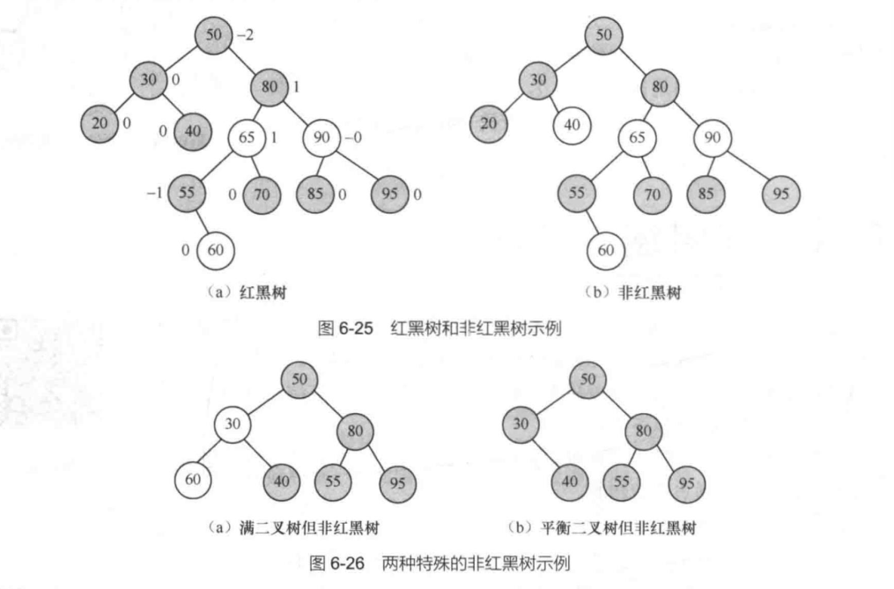

## 外部查找

在实际应用中，数据量往往很大，存储在外存储器上的文件中，数据无法一次性载入内存，数据的存储常是按其写入时间的先后顺序存储。为了加快数据的查找速度，建立索引文件是最普遍的做法。

索引文件，通常按关键字顺序存储了关键字和所属数据在原始文件中地址的对应关系，查找时首先在索引文件中按关键字查找，找到待查关键字后，通过对应的地址信息，到数据文件就能读取到目标数据。

### B树

#### 定义

一颗 M 阶的 B 树须满足如下定义：
1. 或者为空、或者只有一个根结点、或者除了根还有多个结点
2. **根结点**如果有子，则至少有两个儿子、至多有 M 个儿子
3. 除根结点外，每个**非叶子结点**至少有$\lceil M/2 \rceil$个儿子、至多有 M 个儿子
4. 叶子结点都在同一层上，且不带任何信息，可以**视做空结点**、表示查找失败

非叶子节点的结构如下：
$$
(n, A_0, K_1, R_1, A_1, K_2, R_2, A_2, \cdots, K_n, R_n, A_n)
$$
其中：
* $n$：关键字个数, $n$ 个关键字将结点分为 $n+1$ 个区间，即有 $n+1$ 个儿子
* $K_i$: 关键字
* $R_i$: 关键字为 $K_i$ 的数据在原始文件中的地址
* $A_{i-1}$: 在树中关键字值小于 $K_i$ 的结点的地址
* $A_i$: 在树中关键字值大于 $K_i$ 的结点的地址

5 阶 B 树示例：

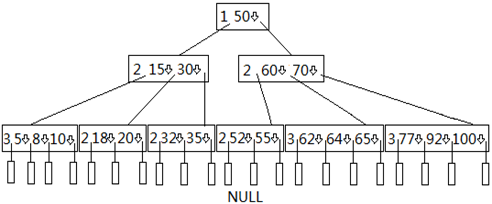

在这个例子中：
* 每个结点第一个数为 $n$，表示关键字个数
* 每个结点后面的数为关键字，关键字后面的箭头为对应的数据地址
* 每个结点向下的线为对应的子结点地址

#### 查找

在上述 5 阶 B 树的例子中，查找关键字 30 的过程如下：
* 首先从B树的根结点入手，关键字30不在根结点中，值小于50，因此顺50左侧指针走向第二层的第一个结点；30为该孩子结点的第二个关键字。
* 关键字30找到后，其右侧空心箭头即标识其数据在原始数据文件中的具体地址。

B树每层只查找一个结点，如果B树作为原始数据文件的索引文件驻留在外存储器上，走向下一层时，只需根据指向的地址将B树中的一个结点读入内存，即对应着一次磁盘的访问，因此B树中一个结点的大小通常也**取一次磁盘读取的数据量**（称一个数据块）。

外存储器访问速度比内存访问速度要慢得多，降低B树的层次就能减少读取外存储器的次数。B树因为是多路搜索树，孩子的数量大于2，所以它比二叉查找树高度要少。

#### 插入

对于高度为h的M阶B树，新结点一般是插在第h层。通过查询可以确定关键字应插入的结点位置，然后分两种情况讨论：
1. 如果该结点中关键字个数小于M-1,则直接插入即可
2. 如果该结点中关键字个数等于M-1,则将引起结点的分裂。以中间关键字为界将结点一分为二，产生一个新结点，并把中间关键字插入到父结点层中；重复上述工作，最坏情况一直分裂到根结点，建立一个新的根结点，整个B树增加一层。

示例：在上述 5 阶 B 树的例子中，插入关键字 90、105 的过程如下：

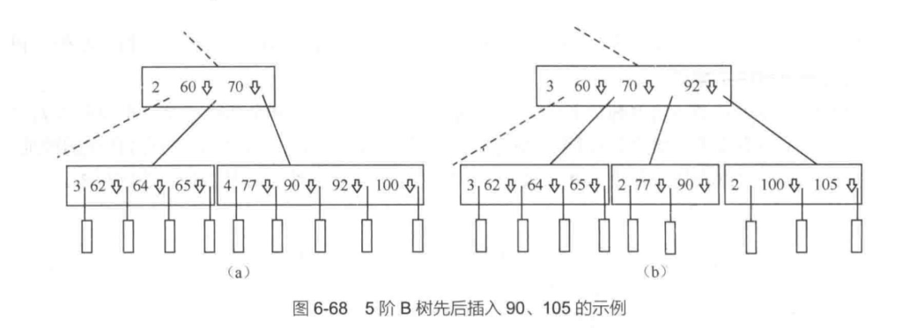

可以看到，在插入关键字 90 时, 按照上节查找方法，找到最后一层的最后一个结点，将 90 插入到 77 和 92 之间，该结点关键字个数由 3 变为 4, 如图 6.68（a）所示。现在再插入关键字 105, 因插入后所在结点的关键字个数大于 4（孩子个数大于 5）, 须将结点一分为二分裂。分裂时，将中间关键字 92 上升到父结点。

对于一颗 B 树的建立，就是不断插入关键字的过程。

5 阶 B 树建立示例：首先有一棵空树；逐一插入60、70、80、90、85、65、75、63

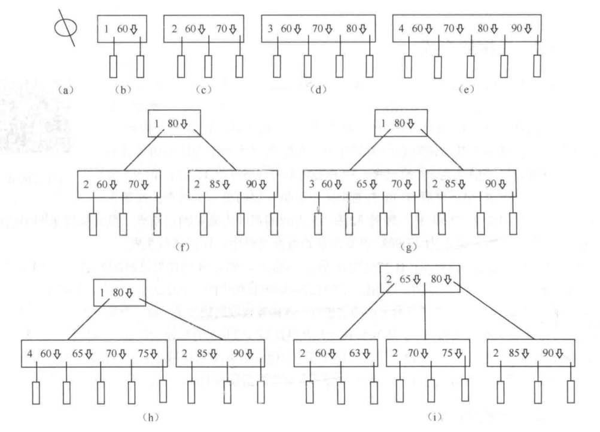

**总结**
1. 首先找到最后一层空结点位置，在其父结点处插入一个关键字
2. 如果父结点中关键字个数在插入前已达上限（M-1），就需逐级向上进行结点分裂，直到某层结点中关键字个数少于上限
3. 树的高度，就是在所有结点逐个插入的过程中分裂结点并向上建立新结点形成的
4. 总的时间消耗为 B 树高度的两倍

#### 删除

在原始数据文件中删除数据，只需要在其 B 树索引文件中删除该数据关键字

删除首先也要进行查找，查找待删数据关键字在B树中的哪个结点上。然后根据结点的情况，将删除按照以下几种情况分别处理：
1. 待删关键字在最下非叶子结点层，再下层就是空结点了。
2. 待删的关键字在中间层，下层仍为非叶子结点层。

**情况1**：待删关键字在最下非叶子结点层，再下层就是空结点了。也分为三种情况：
1. 待删关键字的原本结点中关键字个数大于$\lceil M/2 \rceil - 1$，直接删除即可，并将结点前的关键字个数减1
2. 待删关键字的原本的节点中关键字个数等于$\lceil M/2 \rceil - 1$
    * 左、右兄弟结点中有孩子个数非最小值：从关键字个数非下限的兄弟处借过来一个。如果是从左边兄弟结点处借，借最大关键字；如果是从右边兄弟结点处借，借最小关键字；借来的关键字和父结点的一个关键字交换，将换来的父结点关键字追加到删除关键字的结点中
    * 左、右兄弟结点中孩子个数均为最小值：将删除关键字的结点和一个兄弟结点合并，父结点中的一个关键字下降到合并后的结点中，如果父结点中关键字下移后，关键字个数少于$\lceil M/2 \rceil - 1$，调整继续上移

示例：

原本的 B 树：


删除92：

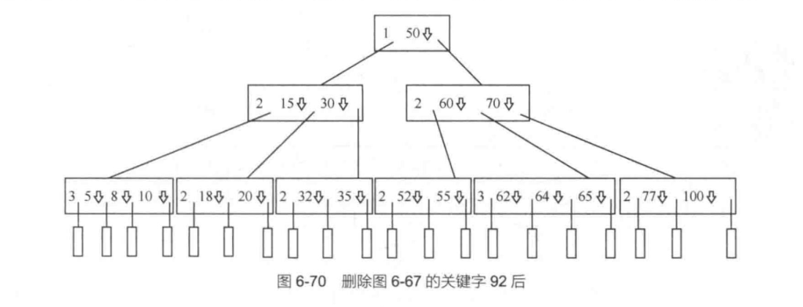

删除20：

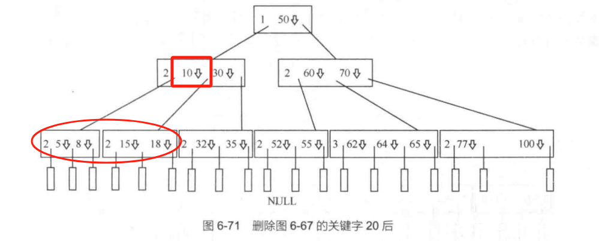

删除18：

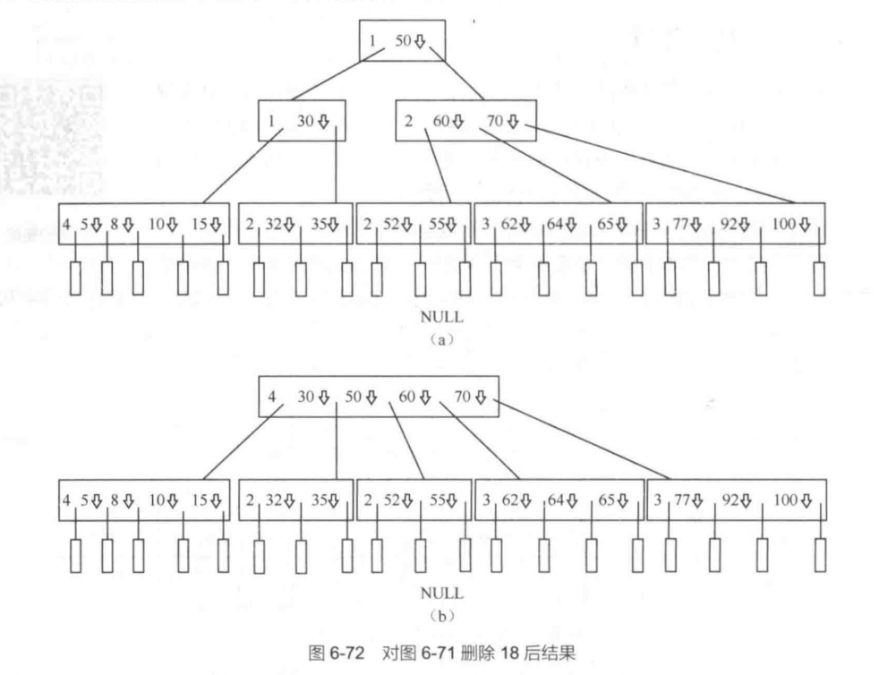

**情况2**：待删的关键字在中间层，下层仍为非叶子结点层。
* 顺着关键字 **左侧**孩子结点找到**最大**关键字 或者顺着 关键字**右侧**孩子结点 找到**最小**关键字替代之，然后层层下移，直到找到的替身结点为最后一层非叶子结点，删除变为情况 1.

示例：

原本的 B 树：

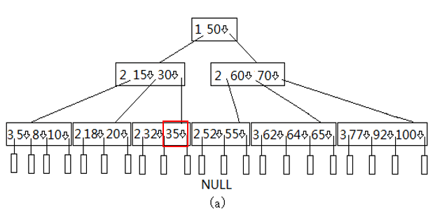

删除50：顺关键字 50 左侧孩子找到最大关键字 35 作为替身代之，任务变为删除最后一层非叶子结点 35，转为情况1

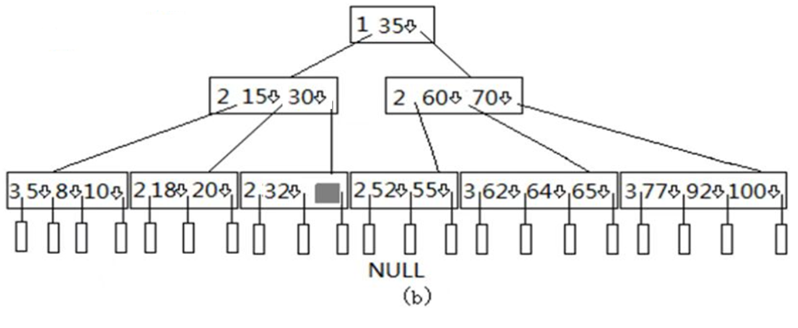

**总结**：

B树是一棵多线索查找树，所有的数据关键字都挂在了树的非叶子结点中，每个关键字右侧字段（空心箭头）标明了其对应数据记录在原始数据文件中的具体地址，因此根据关键字和作为索引的B树的帮助，就能非常方便地在数据文件中找到它。

用途：将大型数据库文件存储在硬盘上，以减少访问硬盘次数为目的

B树的缺点也是明显的，因所有关键字都在B树上，造成B树过于庞大；另外如果要按关键字大小顺序访问所有数据，B树没有任何优势。为了解决这个问题，引入了B+树的概念。

B+树是B树的一种变形，它更适合实际应用中操作系统的文件索引和数据库索引。

### B+树

#### 定义

M 阶的 B+ 树定义如下：
1. 或者为空、或者只有一个根结点、或者除了根还有多个结点
2. 每个非叶子结点至多有M个儿子
3. 非叶子的根结点至少有2个孩子；除了根结点外，每个非叶子结点至少有 $\lceil M/2 \rceil$ 个儿子
4. 非叶子结点结构如下：$$(K_1, A_1, K_2, A_2, \cdots, K_n, A_n)$$
    * $K_i$: 关键字
    * $A_i$: 在树中关键字值小于等于 $K_i$ 的结点的地址
5. 叶子结点和中间结点不同，它存储了数据关键字和它在原始数据文件中的地址信息。所有叶子包含了全部关键字信息，它的关键字个数最少 $\lceil L/2 \rceil$ 个，最多 $L$ 个
6. 每个叶子结点增加一个指针，指向其右侧相邻数据结点的地址

5 阶 B+ 树示例：$M = 3, L = 3$ 通常情况下 M 远大于 L

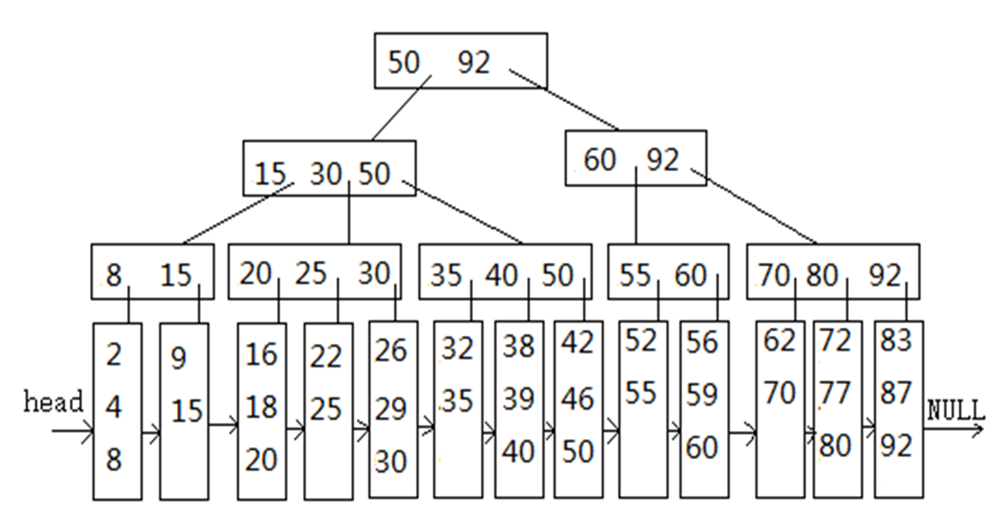

#### 查找

找到的情况：如找 30
1. 第一层从根结点找，30小于等于50，顺50右侧侧指针向下；
2. 第二层最左结点中，30小于等于30，顺30右侧指针向下；
3. 第三层第2个结点中，30小于等于30，顺30右侧指针向下，找到第5个叶子结点，在该叶子中找到30，查找成功。

找不到情况，如找33，
* 同样顺以上过程找到第5个叶子结点，在该叶子中找不到33，查找失败。

#### 插入和删除

B+树的插入和删除关键字的操作和B树类似：
* 先查找，后进行插入、删除。
* 插入总在叶子结点上进行，在插入过程中也面临着结点分裂的可能。
* 在删除的过程中也面临着借用、合并的可能，各种情况的处理方式和B树相同。

#### B树和B+树的比较

1. 查找时间消耗：
    * B 树：B树关键字和对应数据记录地址信息可能分布在非叶子结点的任何结点中，所以查找可能停止在任何一层，时间消耗小于等于树的高度，最差为树的高度
    * B+ 树：B+树的关键字信息只在叶子结点中，查找必须走到叶子结点，时间消耗等于树的高度
2. B+树插入和删除操作的时间消耗，因B树和B+树中的查找时间不同而不同，但B树和B+树的插入、删除，最差时间消耗都是树高度的2倍
3. B+ 树便于按序遍历
    * 用一个指针变量（头指针）保存第一个叶子结点的地址，每个叶子结点尾部增加一个指针，指向右边相邻叶子结点的地址，最右一个叶子结点中的该指针指向空，这样便形成了一个单链表
    * 当需要按照关键字大小顺序遍历原始数据文件中的所有数据时，顺着头指针访问单链表，便能实现原始数据的顺序遍历任务

## 哈希查找

哈希方法希望抛弃比较，具体做法是对数据关键字key，通过一个函数映射H(key)计算出数据在内存中的存储地址，这种方法称为**哈希查找**

### 相关概念

1. 哈希表：以一个可以存储m个数据的连续存储空间（数组）为基础，对数据关键字$k_1, k_2, \cdots, k_m$中任一个关键字$k_i$，函数$H(𝑘_𝑖 )$的值为 0 到 m-1 之间的整数，且 $m≥n$
2. 函数 $H$：哈希函数或散列函数
3. 负载因子/负载系数：$\alpha = n/m$，其中 $n$ 为哈希表中已存储数据的个数，$m$ 为哈希表的长度

理想的哈希函数是将不同的数据分别映射到不同的地址，查找会达到最理想的时间复杂度O(1)。

负载因子越大，空间利用率越高，哈希函数就越难找。负载因子越小，冲突的可能性越小，但空间利用率越低。

一个好的哈希函数应该具有以下特点：
1. 计算速度快；

2. 哈希到的地址均匀、冲突少；

3. 哈希表的负载因子高，尽量减少空间的浪费。

### 哈希函数

1. 直接寻址法：哈希函数为$$ H(\mathrm{key}) = a \cdot \mathrm{key} + b $$

    * 如元素关键字序列{100，200，330，520，600，815}， 通过函数H(key) = key/100-1，将以上序列映射到{0，1，2，4，5，7}下标分量中。哈希表的大小可以取m=8，负载因子为 $α=6/8=0.75$.

2. 除留余数法：哈希函数为$$ H(\mathrm{key}) = \mathrm{key} \mod p$$

    * 如：元素关键字序列{35，192，64，5，76，653}， 通过函数H(key) = key mod 7，将以上序列映射到{0，3，1，5，6，2}下标分量中。此例哈希表的大小可以取m=7，负载因子为"α"=6/7=0.86。

    * 函数中 p 取不大于表长且最接近表长 m 素数时效果最好，且p最好取1.1n～1.7n之间的一个素数（n为数据元素个数）。p大于n，能保障元素全部入表，p取素数是为了尽量减少规律性的空间浪费

3. 数据分析法：数据的关键字中如果有一些位上数据分布比较均匀，能区分出不同的数据元素，就可以将这些位取出来作为数据元素的存储地址用。

    * 如一组元素：单用第5位就能区分出不同元素，再加上数据元素的个数不超过10，故取第5位作为哈希函数值就可以了，它们被映射到{4，5，3，2，0，7}下标分量上
        | 3 4 2 0 4 2 2 6 |
        | --------------- |
        | 3 4 2 0 5 8 7 9 |
        | 3 4 2 0 3 2 9 6 |
        | 5 4 7 4 2 2 0 6 |
        | 5 4 7 4 0 1 7 7 |
        | 5 4 7 4 7 5 0 0 |

4. 平方取中法：如果关键字分布不均匀，也可以将关键字首先平方，有时平方后的结果中的几位就会变得均匀，这时再用直接定址或者数据分析法获得合适的哈希地址

    * 如关键字136，平方后为18496，取其中的第2、3位得49，49便为关键字136的数据元素的哈希地址。

5. 折叠法：当关键字位数相比于数据元素的个数大得多，也可以将其按照哈希表大小分割成若干段，并将这些段相加，得到的和作为哈希地址

    * 如有 100 个数据元素，其中一个关键字为：1 3 5 7 6 3 4 2 0 8 7 5, 以长度为 2 进行折叠并相加 13+57+63+42+08+75=250, 取后两位得 50, 作为其哈希地址

### 冲突解决

在考虑到空间负载因子的情况下，很难找到一个函数能将所有数据都映射不同的地址上去，势必会存在两个关键字值**不同**的数据却得到了**相同**的哈希地址，这就叫**冲突**。一旦发生了冲突，就要采取一定的措施解决冲突了。

常见的解决冲突的办法有线性探测法、二次探测法、链地址法等

闭哈希表：冲突时重新计算哈希地址，再计算出的地址仍然在原来的哈希表中

* 线性探测法
* 二次探测法

开哈希表：冲突时在原来的哈希表外寻找一个存储地址

* 链地址法

---

冲突解决：

1. 线性探测法：当冲突发生时用$$ (H(\mathrm key)+i)\%m $$的方法重新定址。其中 $i$ 为冲突的次数，$m$ 为哈希表的大小。

    * 如：如元素关键字序列{100，200，330， 520， 550，600，815}，设m=10，采用哈希函数H(key) = key/100-1

        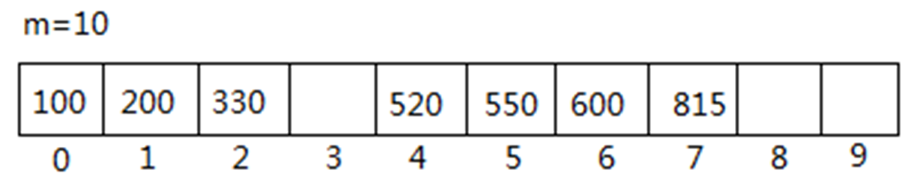

        这里550 被散列到 4 下标位置，它和 520 发生冲突。因为是 550 和其他元素的第 1 次冲突，于是被散列到(4+1)%10 即 5 的位置上.之后，600 经过哈希函数被散列在下标为 5 的位置上，因为已经存储了 550, 故发生冲突，按照线性探测法，被分配到下标为(5+1)%10=6 的位置上
    
    * 注：先来的关键字先处理，后来的关键字后处理

2. 二次探测法：当冲突发生时用$$ (H(\mathrm key) \pm i^2) \% m$$的方法重新定址。第一次冲突，取$(H(key)+1^2)\%m$；第2次冲突，取 $(H(key)-1^2)\%m$；第3次冲突，取$(H(key)+2^2)\%m$；以此类推

    * 这种方法较线性方法比，位置移动的幅度大，不容易造成二次冲突

3. 链地址法：不在原来的散列表中找地址，散列表中根本就不存储实际的元素，而是存储一个单链表的首结点地址，元素存储在单链表中。如果不同的元素被散列在同一位置，则把它们放到同一个单链表中，不同元素如果被散列在不同位置，它们就被放在不同的单链表中

    * 如：哈希函数为$H(\mathrm key) = \mathrm key \mod 17$

        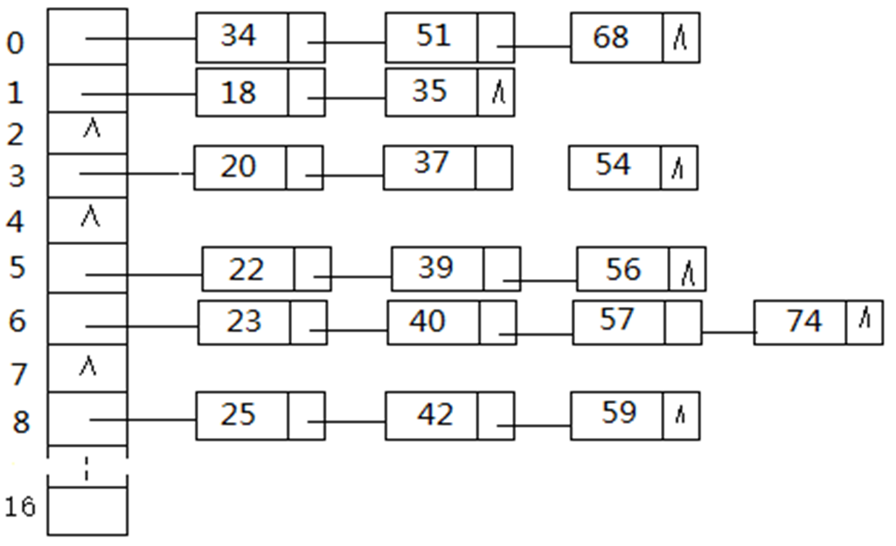