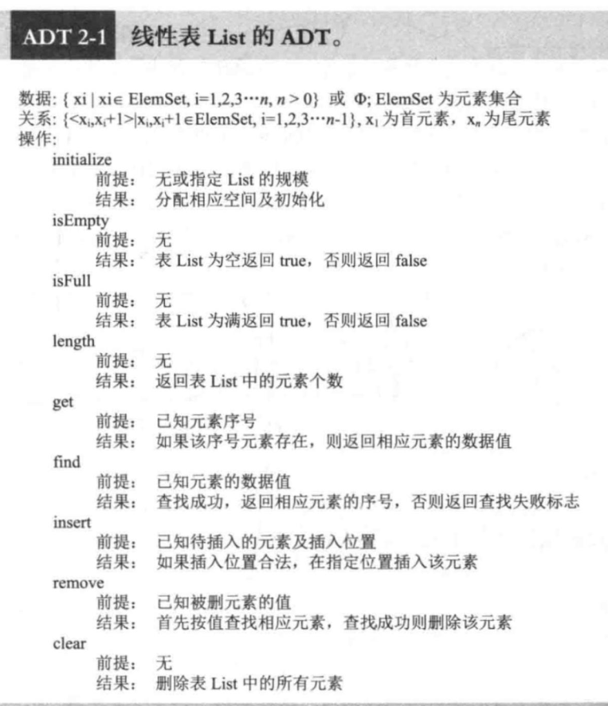
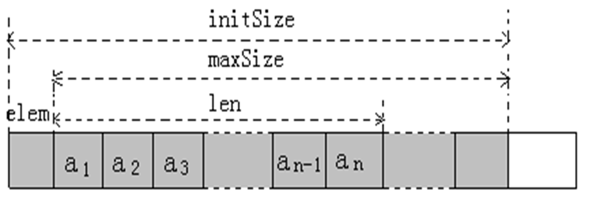
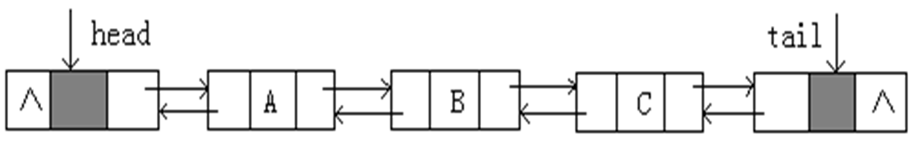
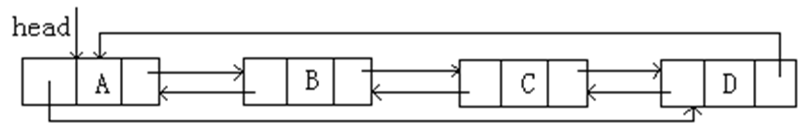
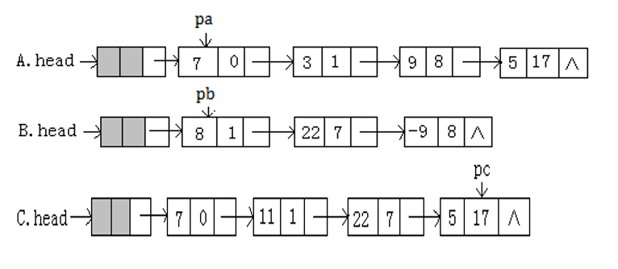

# 线性结构

## 线性表

**线性结构定义**：

1. 一组特征相同且数量有限的元素构成的集合。该集合可以为空，也可以不为空。

2. 当不为空时，有唯一一个元素被称为首元素，有唯一一个元素被称为尾元素。

3. 除了尾元素，每个元素有且仅有一个直接后继元素；除了首元素，每个元素有且仅有一个直接前驱元素。

**线性表**的**ADT**：

### 顺序表

顺序存储的线性表称顺序表

1. 存储：

    * elem: 存储线性表元素的一维数组

    * initSize: 线性表的初始容量

    * maxSize: maxSize = initSize - 1

    * elem[0]: 用于其他特殊用途

    * len: 元素个数，即线性表的长度

    * 图示：

        

2. 操作实现效率

    * 时间复杂度：

        * 查找、插入、删除：O(n)

        * 找第 k 个元素：O(1)

        * 其余操作：O(1)

### 链表

链式存储的线性表称链表

**单链表特点**：

1. 头指针 head 指向头结点

2. 头结点不是线性表中的一部分，它的指针字段 next 指向第一个结点（首结点）

3. 最后一个结点的指针字段 next 为空

**操作实现效率**：

* 插入、删除：O(1)

* 查找：O(n)

* 找第 k 个元素：O(n)

**单循环链表**：

1. 尾结点的指针字段 next 指向头结点

    * 优点：可以从任意结点开始遍历

2. 不带头结点的单循环链表：head 指向首结点

**双向链表**：

1. 每个结点有两个指针字段：prior 和 next

    * 示例：

        

2. 空双向链表：只有头尾结点

**双向循环链表**：不带头尾结点的双向循环链表；空双向链表为nullptr

## 应用

### 一元多项式

**存储**：使用链式存储

1. 每个结点存放一元多项式中的一项的信息。信息包括该项的系数和幂，零系数项不予存储

2. 按照幂由小到大的原则进行，这样该单链表便成为幂有序的单链表

3. 结点字段：

    * coef: 系数

    * exp: 幂

    * next: 指向下一项

**操作**：

1. 相加：对pa和pb所指结点，反复执行如下操作，直至其中一个单链表中的结点全部读取完毕

    * 幂指数相等：如果这二个结点的系数之和为零，和式中不增加项，否则按照相加后的系数、相应幂指数创建一个新结点，作为和式单链表C的末结点，pa、pb后移。

    * 指针pa幂指数小：按pa指向的结点的系数、幂指数创建一个新结点作为单链表C的末结点，pa后移，pb不变。

    * 指针pb幂指数小：按pb指向的结点的系数、幂指数创建一个新结点作为单链表C的末结点，pb 后移，pa不变。

    将非空多项式单链表(可能是A的单链表，也可能是B的单链表)中的剩余结点，按序逐个创建新结点插入在单链表 C 的尾部

    示例：C = A + B

    

### 稀疏矩阵

**定义**：矩阵中的非零元素个数远远小于矩阵元素总数，并且非零元素的分布没有规律

* **存储**：稀疏矩阵存储的直观方法是只存储其中的非零元素和非零元素所在的位置

    * 每个非零元素可用一个三元组表示：(i, j, a[i][j])，然后将此三元组按照一定的次序排列