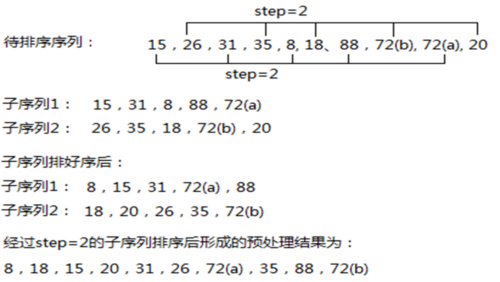
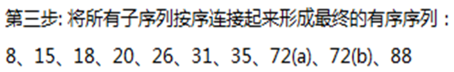
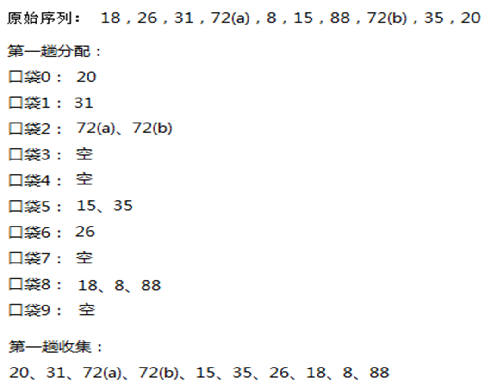

# 排序

查找表明，有序表的查找可远远快于无序表。如有序表的二分查找就能使时间复杂度降到O(log2n)，因此排序是常见的数据操作之一。

通常待处理的数据不是单一的值，而是含有若干个字段的复杂数据记录，选择其一字段的值作为排序中比较的依据，该字段称作关键字。排序只涉及到关键字，下文中数据值特指该数据的关键字值。

如无特殊说明，排序后都假定是**非递减**的序列。

**稳定性**：
    1. **稳定排序**：待排序数据中如果有关键字值**相同**的元素，经过某种排序算法后其相对先后位置在排序前后**没有变化**
    2. **不稳定排序**：待排序数据中如果有关键字值**相同**的元素，经过某种排序算法后其相对先后位置在排序前后**可能发生变化**

## 内排序

待排序数据可全部一次性载入内存，排序只和内存打交道，在程序中的具体表现就是数据可以全部放入声明的一组变量中

### 冒泡排序

**思想**：两两比较

* 第1和第2个元素比较，如果第1个元素**大于**第2个元素，两者交换。第2和第3个元素比较，如果第2个元素**大于**第3个元素，两者交换。

* 如此操作，直到第n-1个元素和第n个元素比较、交换后最大元素被换到了序列尾部即第n个位置上。此称第一趟排序。之后，在前n-1个元素中进行如上操作，次大元素被换到了第n-1的位置上。此称第二趟排序

* 依此方法操作，直到前面余下的元素个数为1时停止。结果是无序序列变为有序序列。

**代码**：

``````cpp
void BubbleSort(int A[], int n) {
    bool change = true;
    int tmp;
    for (int i = 0; i < n - 1 && change; i++) {
        change = false;
        for (int j = 0; j < n - i - 1; j++) {
            if (A[j] > A[j + 1]) {
                tmp = A[j];
                A[j] = A[j + 1];
                A[j + 1] = tmp;
                change = true;
            }
        }
    }
}
``````

**分析**：

1. **稳定性**：冒泡排序是稳定的排序算法（只有大于的时候才会交换）

2. **时间复杂度**：最好情况下，序列已经有序，只需进行 $n-1$ 次比较，时间复杂度为 $O(n)$；最坏情况下，序列逆序，需要进行 $n(n-1)/2$ 次比较，时间复杂度为 $O(n^2)$；平均时间复杂度为 $O(n^2)$

### 插入排序

**思想**：将一个元素插入到已经排好序的序列中（以两两比较为基础）

1. 首先将序列中仅由第1个元素构成的序列视作一个有序序列，将序列中的第2个元素插入到前面有1个元素的有序序列中，形成一个有2个元素的有序序列；

2. 将序列中的第3个元素插入到前面有2个元素的有序序列中，形成一个有3个元素的有序序列；

3. 依此类推，直到序列中的最后一个元素插入到前面有n-1个元素的有序序列中，形成一个有n个元素的有序序列。

**代码**：

``````cpp
void insert(int A[], int n, int x) {
    int i;
    //从后往前找第一个不比x大的元素，大者后移一位
    for (i = n - 1; i >= 0; i--) {
        if (A[i] <= x) break;
        A[i + 1] = A[i];
    }

    A[i+1] = x; //在腾出的位置上存新元素x
}

void InsertSort(int A[], int n) {
    for (int i = 1; i < n; i++)
        insert(A, i, A[i]);
}
``````

**分析**：

1. **稳定性**：插入排序是稳定的排序算法(插入时不会改变相同元素的相对位置)

2. **时间复杂度**：最好情况下，序列已经有序，只需进行 $n-1$ 次比较，时间复杂度为 $O(n)$；最坏情况下，序列逆序，需要进行 $n(n-1)/2$ 次比较，时间复杂度为 $O(n^2)$；平均时间复杂度为 $O(n^2)$

### 希尔排序

**思想**：预处理，使序列比较有序，然后进行插入排序

1. **预处理方法**：将原始序列按不同步长分成若干子序列，分别进行插入排序，使序列变比较有序，降低插入排序时间消耗

2. 一般来说，step 的取值从 n/2 开始，每次减半，直到 step = 1

示例：

 


**代码**：

``````cpp
void ShellSort(int A[], int n) {
    int step, i, j, tmp;
    for (step = n / 2; step > 0; step /= 2) {
        for (i = step; i < n; i++) {
            tmp = A[i];
            
            while (j >= step && A[j - step] > tmp) {
                A[j] = A[j - step];
                j -= step;
            }
            A[j] = tmp;
        }
    }
}
``````

**分析**：

1. **稳定性**：希尔排序是不稳定的排序算法(值相同的元素可能被分在不同的子序列中，导致相对位置发生变化)

2. **时间复杂度**：不做进一步分析

### 归并排序

**思想**：分治法，将序列分成两个子序列，分别排序，然后合并

1. 归并算法：将两个有序序列合并成一个有序序列

2. 归并排序算法：原始序列中，每个元素可以看作是一个长度为1的有序序列，经过两两归并，形成多个长度为2的有序序列；再经过相邻两个有序序列归并，形成多个长度为4的有序序列；反复如此，最后形成一个长度为n的有序序列。

示例：


**代码**：

``````cpp
void Merge(int A[], int low, int mid, int high) {
    int *tmp = new int[high - low + 1];
    int i = low, j = mid + 1, k = 0;
    while (i <= mid && j <= high) {  // 将两个有序序列合并
        if (A[i] <= A[j]) tmp[k++] = A[i++];
        else tmp[k++] = A[j++];
    }
    while (i <= mid) tmp[k++] = A[i++];  // 将剩余元素复制到tmp中
    while (j <= high) tmp[k++] = A[j++];  // 将剩余元素复制到tmp中
    for (i = 0; i < k; i++) A[low + i] = tmp[i];
    delete[] tmp;
}

void MergeSort(int A[], int low, int high) {
    if (low < high) {
        int mid = (low + high) / 2;
        MergeSort(A, low, mid);
        MergeSort(A, mid + 1, high);
        Merge(A, low, mid, high);
    }
}
``````

**分析**：

1. **稳定性**：归并排序是稳定的排序算法

    * 在两两合并算法中，对前后两个有序序列中元素比较时，后者元素大才能胜出，因此值相同的元素在合并中能保持原本的相对前后位置

2. **时间复杂度**：为 $O(n\log_2n)$

### 快速排序

**思想**：分治法，选取一个基准元素，所有小于它的元素移到它的前面，大于等于它的元素移到它的后面；对标杆前后两个子序列分别排序后，整个序列就有序了

示例：


**代码**：

``````cpp
void QuickSort(int A[], int low, int high) {
    if (low < high) {
        int i = low, j = high, pivot = A[low];
        while (i < j) {
            while (i < j && A[j] >= pivot) j--;
            if (i < j) A[i++] = A[j];
            while (i < j && A[i] < pivot) i++;
            if (i < j) A[j--] = A[i];
        }
        A[i] = pivot;
        QuickSort(A, low, i - 1);
        QuickSort(A, i + 1, high);
    }
}
``````

**分析**：

1. **稳定性**：快速排序是不稳定的排序算法

    * 当序列中有两个关键字值相同的元素，且均小于标杆元素，其中一个居于序列最右侧时，第一次移动就将最右侧元素移到了最左端，这样两个关键字值相同的元素相对位置就发生了变化

    * 示例：

        

2. **时间复杂度**：最好情况下，每次划分都能均匀划分，时间复杂度为 $O(n\log_2n)$；最坏情况下，每次标杆落定后，其左边或者右边序列都有一个序列元素个数为0，时间复杂度为 $O(n^2)$

### 选择排序

**思想**：以两两比较为基础从左到右，为有序序列中每个位置选择合适的元素。

1. 具体为：

    * 在下标0~n-1范围找出最小值，换到0下标位置；

    * 在下标1~n-1范围找出最小值，换到1下标位置；…

    * 在下标n-2~n-1范围找出最小值，换到n-2下标位置.

示例：


**代码**：

``````cpp
void SelectSort(int A[], int n) {
    int min, tmp;
    for (int i = 0; i < n - 1; i++) {
        min = i;
        for (int j = i + 1; j < n; j++) {
            if (A[j] < A[min]) {
                min = j;
            }
        }
        if (min != i) {
            tmp = A[i];
            A[i] = A[min];
            A[min] = tmp;
        }
    }
}
``````

**分析**：

1. **稳定性**：选择排序是不稳定的排序算法

    * 当找到最小值后，交换可能发生在不相邻元素之间，破环了原本的顺序，故是不稳定排序。

    * 示例：

        

2. **时间复杂度**：选择排序的时间复杂度为 $O(n^2)$

### 堆排序

**思想**：把待排序序列看成一个顺序存储的完全二叉树，利用堆的性质进行排序

1. 构造大顶堆：从最后一个非叶子节点开始，从下往上调整；即对序列**从后往前**逐一检查、调整使得每个节点的值都大于其左右子树所有结点的值

2. 堆排序：

    1. 将存于数组中的序列看作是一棵完全二叉树的顺序存储。

    2. 首先按照堆的概念调整之，使之成为一个大顶堆。

    3. 摘取大顶，换到待处理元素最后位置。

    4. 继续调整新的根使之满足大顶堆概念，得到次大元素。

    5. 继续后移，直到序列中元素全部有序。

示例：原始序列：18,26,31,72(a), 8,15,88,72(b), 35,20

 

**代码**：

``````cpp
// 对大小为 n 的堆中以 i 为根的子树进行调整，使其满足大顶堆的性质
void AdjustHeap(int A[], int i, int n) {
    int tmp = A[i];
    for (int j = 2 * i + 1; j < n; j = 2 * j + 1) {
        if (j + 1 < n && A[j] < A[j + 1]) j++;  // 右子更大
        if (A[j] > tmp) {
            A[i] = A[j];
            i = j;  // 继续向下调整
        } else break;
    }
    A[i] = tmp;
}

void HeapSort(int A[], int n) {
    // 构建大顶堆，从最后一个非叶子节点开始
    for (int i = n / 2 - 1; i >= 0; i--) {
        AdjustHeap(A, i, n);
    }

    // 交换堆顶元素和末尾元素，重新调整堆
    for (int i = n - 1; i > 0; i--) {
        // 交换堆顶元素和末尾元素
        int tmp = A[0];
        A[0] = A[i];
        A[i] = tmp;
        // 重新调整第 0 个元素
        AdjustHeap(A, 0, i);
    }
}
``````

**分析**：

1. **稳定性**：堆排序是不稳定的排序算法

    * 如果左、右子一样大，选择右子为最大子，优先进入堆顶，并先于左子被替换到序列尾部

    * 当父结点值和最小结点的值相同时，情况可能发生反转，排序结果显示为不稳定排序

    * 示例：

        

2. 堆排序时间消耗由两部分组成：

    * 建堆：是 $O(n)$

    * 摘取大顶：是 $O(n\log_2n)$

    * 故堆排序的时间复杂度为 $O(n\log_2n)$

### 基数排序(口袋排序法)

**思想**：把单一关键字中的不同位数视作多关键字进行排序，使用LSD方法，基于若干次的分配和收集，每次分配都是将元素分配到若干个不同的口袋中，每次收集也是将若干个口袋中的元素顺次收集成新的序列

**MSD**：最高位优先法

1. 从最高位开始，依次对每一位进行排序，直到最低位

例子：原始序列18、26、31、72(a)、8、15、88、72(b)、35、20

* 可先根据十位上的值按序将数据分到10个不同子序列中，然后对每个子序列中的数据再按个位分到10个子序列中，将各个子序列顺序连接起来便得到最终的有序序列。

* 图示：

     

    

* 可以看出：如果数字有m位，就有m层，比较复杂。

**LSD**：最低位优先法

1. 从最低位开始，依次对每一位进行排序，直到最高位

例子：原始序列18、26、31、72(a)、8、15、88、72(b)、35、20

* 可先根据个位上的值按序将数据分到10个不同子序列中，然后对每个子序列中的数据再按十位分到10个子序列中，将各个子序列顺序连接起来便得到最终的有序序列。

* 图示：

     

* 可以看出：如果数字有m位，只需进行m趟的分配和收集，相对简单。

**分析**：

1. **稳定性**：基数排序是稳定的排序算法

2. **时间复杂度**：假如元素的最大值位数为 m，分配、收集要各自进行 m 趟，故整个算法复杂度是 $O(mn)$。

### 内部排序算法比较


## 外排序

如果待排序数据不能一次性全部载入内存，在排序过程中还需要进行内、外存之间的数据交换，在程序中的具体表现是数据只能分批从文件中读入内存变量中

根据内存容量的大小一次调入一定量的数据，形成一个数据序列，该序列在内存中可以按照某种内排序的方法进行排序，然后将排好的序列写入外存，之后再调入其他未排序的数据进入，以此类推。

最终在外存上原始的待排序序列分割成了**多个有序序列**，之后再设法将数据**分段调入内存**，进行有序数据段的**归并**。

### k 路归并排序

最简单的归并是二路归并，二路归并是将两个有序序列归并为一个有序序列。

在外排序中，二路归并需要 4 条磁带，这 4 条磁带假设为 A1、A2、B1、B2, 原始数据在磁带 A1 上，

1. 经过处理后形成了 m 个有序序列，分别放置在磁带B1、B2 上，

2. 此后从 B1、B2 上分别取出第一个有序序列，进行二路合并，形成一个新的有序序列放到 A1 上；

3. 再次从 B1、B2 上分别取出下一个有序序列，进行二路合并，形成一个新的有序序列放到 A2 上；

4. 如此反复，直到 B1、B2 中所有有序序列处理完毕。

5. 然后同上面操作，从 A1、A2 中取有序序列，归并后放在 B1、B2 上，如此反复直到在某个磁带上只有一个有序序列，其余磁带为空

图示：


* 因此：如果有2K个磁带，就可以实现k路归并。

### 多阶段归并

如果只有 k + 1 个磁带，利用多阶段归并也可以实现 k 路归并。

1. 假设有k+1个磁带，分别为A、B1、B2、…Bk，将分别来自B1、B2、…Bk的k个有序序列进行k路归并为一个有序序列，放入A

2. 之后再从B1、B2、…Bk分别取下一个有序序列进行k路归并为一个有序序列，继续放入A；如此操作，直到某个磁带Bi中的没有有序序列

3. 此时又变成k个磁带上有有序序列，一个磁带上没有有序序列的情况。按照上面的方法从k个有数据的磁带上继续逐次进行k路归并到空磁带上

4. 最后直到只有一个磁带上有数据，该数据序列是一个有序序列

示例：表中数字为有序序列个数


* 其中 Tl、T2、T3、T4 为4 条磁带，进行3 路归并。

1. 初始时，T1 空，T2、
T3、T4 分别有 8、13、21 个有序序列，现在在 T2、T3、T4 各取一个有序序列进行 3 路归并形成一个有序序列放入 T1, 

2. 循环如此，直到 T2、T3、T4 上最少的有序序列 8 耗尽，这样就有 8 次 3 路归并,在 T1 上留下 8 个有序序列，此时 T2 上的 8 个有序序列在归并中使用完毕，T3 中的 13 个用掉 8 个余5 个，T4 中的 21 个用掉 8 个余 13 个。

3. 现在 T2 磁带空出，其余3 个磁带分别有若干条有序序列，再同第一轮方法类似进行归并处理，直到最后只有某一条磁带上有 1 个有序序列，其余磁带为空。

* 如果已排序片段的数目是一个**斐波纳契数** Fn，那么最好的分布方法是把它们分解成 k 个连续的斐波纳契数。否则，就在磁带上填充长度为0的、虚拟的已排序片段，将己排序片段数增加到一个向上最靠近的斐波纳契数

### 置换选择

**思想**：通过通过拉长每个有序序列的长度来减少初始归并段的个数。

**方法**：

1. 首先将磁带 A 上的 p 个元素读入内存，在其中选出最小值，将最小值写入磁带 B, 空出的位置从 A 上再读入一个元素

2. 如果该元素不小于刚刚在内存中被选为最小值并写入 B 中的元素，该新元素可以参加下一轮的最小值求解，即它可以进入第一个初始归并段，由此第一个初始归并段就突破了 p 大小的限制

**示例**：


1. 首先内存中的最小值 3 写出，空位 6 进入，因为 6>3, 故 6 可参与当前有序序列数据的选择；

2. 然后最小值 5 写出，2 进入，因为 2<5, 故 2 不能参与，为了区别，不能参与的元素用灰底标出；

3. 最小值 6 写出，0 进入，因 0<6, 故 0 也不能参与；

4. 最小值 8 写出，9 进入，因 9>8, 故 9 可参与；

5. 最小值 9 写出，4 进入，因 4V9, 故 4 不能参与，于是可参与当前有序序列形成的元素为空，第一个有序序列形成过程结束，有序序列为 3、5、6、8、9,序列长度为 5, 突破了 3 的限制。

6. 如此操作，直到所有待排序元素读入内存并写出，最后获得图中所示的 3 个有序的初始归并段。

数据读入内存中后，每次都只是找最小值。如果按照上图的方法输出一个元素，在输出元素的位置上再读入一个新的数据，最小值的选择就只能逐个比对，时间消耗为 $O(p)$；

如果内存中元素按照最小化堆来存储，输出元素就总是下标为0的元素，新读入的元素一开始放入空出的位置，紧接着对它进行调整，使得整个序列仍然保持堆结构，时间消耗为 $O(log_2⁡𝑝)$。

### 最佳归并树

用置换选择方法获得的初始归并段长度并不一致，这样在k路归并时有序段的不同组合就可能造成对磁带读写的次数不同。

如：9个归并段中数据元素的个数分别为6、8、13、9、30、7、20、15、18，采用普通归并方法，总的磁带读写次数为504；如果采用类似哈夫曼树归并策略：**小者优先**，总的磁带读写次数为486，方法更优。


* 从上图可以看出，如果采用最佳归并树，总的磁带读写次数最少。

* 初始归并段的次数并不总是正好使得每次归并都有3个可用，如果有缺少，可增补t个长度为0的虚段。

    