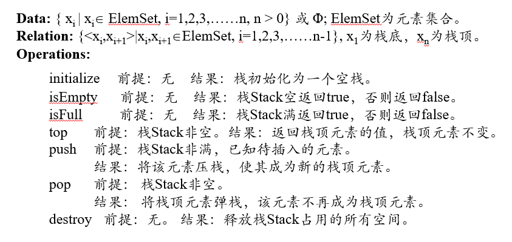
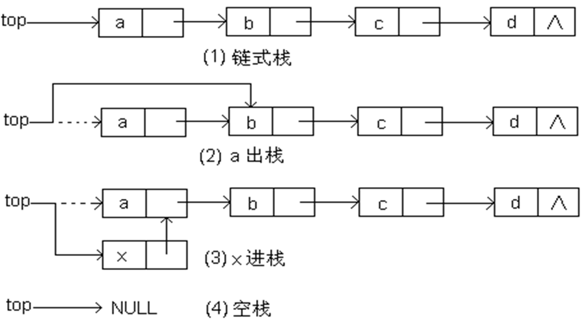

# 栈

如果元素到达线性结构的时间越晚，离开的时间就越早，这种线性结构称为栈（Stack）或堆栈

**ADT**：



## 顺序栈

**定义**：栈的顺序存储结构称为顺序栈，是一种用顺序表实现的栈，可以将栈底放在数组的0下标位置

* 栈**空**标志：top=-1

* 栈**满**标志：top=MaxSize-1

**操作**：

* 效率：基本操作的时间复杂度均为O(1)

**共享栈**：多个栈共享空间

* top 指向实际栈顶的后一个位置

* 假设有 m 个栈，
  
    * 第i个栈空的条件：top[i]=bottom[i]；

    * 第i个栈栈满条件为: 
      
        * 当i<m-1时，top[i]=bottom[i+1]；

        * 当i=m-1时，top[i]=maxSize。

**双共享栈**：可以将两个栈相向设置，即两个栈的栈底分别设置在连续空间的两个端点。

* 栈空的条件top[i]=bottom[i], i=0或1，两个栈不一定同时为空；

* 栈满的条件top[0]=top[1]，即两个栈当中只剩下一个空位置的时候栈满，两个栈必定同时栈满。

## 链栈

**定义**：用不连续的空间和附加指针来存储元素及元素间的关系。

* 栈顶指针top指向处于栈顶的结点，即单链表中的首结点。

* 图示：

    

* 操作性能：

    * 析构：O(n)

    * 其他操作：O(1)

## 栈的应用

### 括号配对

**算法**：

1. 首先创建一个字符栈

2. 从源程序中读入字符：

    * 如果是开括号，将其进栈；

    * 如果是闭括号，判断栈是否为空，若为空则出错；否则，将栈顶元素出栈，判断是否与当前字符匹配，若不匹配则出错。

3. 继续从文件中读入下一个符号，非结束符则转2，否则转向4。

4. 如果栈为空，则括号匹配正确，否则出错。

### 表达式计算

表达式计算涉及到两个方面：

1. 中缀式转后缀式

2. 后缀式计算

这里为了简化，限定操作数为单个数字，操作符为+、-、*、/，括号只有小括号。

**中缀式转后缀式**：

1. **思想**：

    1. 操作数保持原来的相对位置，操作符先计算的先出现，优先级高的运算符先计算。优先级：

        * 运算符不同: 括号 > 乘除 > 加减

        * 运算符相同: 先到的优先级高

    2. 当读入的是操作数时，直接输出

    3. 当读入的是操作符时，当读入的运算符优先级高时，因不知是否后续读入的操作符优先级更高，只能将本次读入的运算符暂存，继续读入中缀式。当读入的运算符优先级低时，才可能计算刚才暂存的运算符(即输出)

    4. 对于括号：即将进入栈的开括号，优先级最高；已经在栈顶的开括号，优先级最低

    5. 括号在后缀式中是要消失的，消失靠闭括号。当读入一个闭括号时，计算之前进栈的运算符，直到遇到一个开括号，然后开闭括号双双消失即可。

    6. 总结：
    
        * 用栈暂存运算符
        
        * 当读入的运算符优先级**低于**栈顶的运算符时，要先计算栈顶的运算符（即输出栈顶的运算符），直到**栈顶的运算符优先级低**于读入的运算符或栈为空，优先级按照1中的规定。
        
        * 如果读入的运算符是**闭括号**，要计算栈顶的运算符**直到遇到开括号**。
        
        * 全部读入后，栈中可能还有运算符，要全部输出。

2. **算法**：对一个中缀表达式，从左至右顺序读入各操作数、运算符。

    1. 当读入的是操作数时，直接输出

    2. 当读入的符号是开括号，直接进栈

    3. 当读入的符号是闭括号，反复进行栈顶元素出栈、输出，直到弹栈的是开括号。

    4. 当读入的是操作符时，
    
        * 如果栈顶操作符的优先级更高，反复弹栈、输出直到栈顶元素优先级低于读入操作符的优先级，读入操作符压栈；
        
        * 如果栈顶操作符的优先级低，读入的运算符进栈。

**后缀式计算**：

1. **思想**：从左至右扫描后缀式，遇到操作数则进栈，遇到操作符则从栈中弹出两个操作数（先弹出的是操作符后的数--操作数，后弹出的是操作符前的数--被操作数），进行运算，将结果再进栈。

2. **算法**：

    1. 声明一个操作数栈，依次读入后缀式中的字符。

    2. 若读到的是操作数，将其进栈；

    3. 若读到的是运算符，将栈顶的两个操作数出栈。后弹出的操作数为被操作数，先弹出的为操作数。将出栈的两个操作数完成运算符所规定的运算后将结果进栈。

    4. 继续读入后缀式中的字符，如上处理，最后直到后缀式中所有字符读入完毕。

    5. 当完成以上操作后，栈中只剩一个操作数，弹出该操作数，它就是表达式的计算结果。

**代码**：

``````cpp
int inToSurForm(char *inStr, char *surStr) {
    linkStack<char> s;
    int i, j;
    char topCh;

    s.push('#');

    i = j = 0;

    while(inStr[i] != '\0') {
        if (inStr[i] >= '0' && inStr[i] <= '9') {
            surStr[j++] = inStr[i++];
        } else {
            switch(inStr[i]) {
                case '(':
                    s.push(inStr[i]);
                    break;
                case ')':
                    topCh = s.top();
                    s.pop();
                    while(topCh != '(') {
                        surStr[j++] = topCh;
                        topCh = s.top();
                        s.pop();
                    }
                    break;
                case '+':
                case '-':
                    topCh = s.top();
                    while (topCh != '#' && topCh != '(') {
                        // 只有左括号和底垫优先级低于+，-
                        s.pop();
                        surStr[j++] = topCh;
                        topCh = s.top();
                    }
                    s.push(inStr[i]);
                    break;
                case '*':
                case '/':
                    topCh = s.top();
                    while (topCh == '*' || topCh == '/') {
                        // *, / 后来者优先级低
                        s.pop();
                        surStr[j++] = topCh;
                        topCh = s.top();
                    }
                    s.push(inStr[i]);
                    break;
            }
            i++;
        }
    }

    // 读入完毕，将栈中剩余的运算符输出
    topCh = s.top();
    while (topCh != '#') {
        s.pop();
        surStr[j++] = topCh;
        topCh = s.top();
    }
    surStr[j] = '\0';
}

int calcPost(char *surStr) {
    int op1, op2, tmp, i;
    linkStack<int> s;

    i = 0;

    while (surStr[i] != '\0') {
        if (surStr[i] >= '0' && surStr[i] <= '9') {
            s.push(surStr[i] - '0');
        } else {
            op2 = s.top();
            s.pop();
            op1 = s.top();
            s.pop();
            switch(surStr[i]) {
                case '+':
                    tmp = op1 + op2;
                    break;
                case '-':
                    tmp = op1 - op2;
                    break;
                case '*':
                    tmp = op1 * op2;
                    break;
                case '/':
                    tmp = op1 / op2;
                    break;
            }
            s.push(tmp);
        }
        i++;
    }

    return s.top();
}


