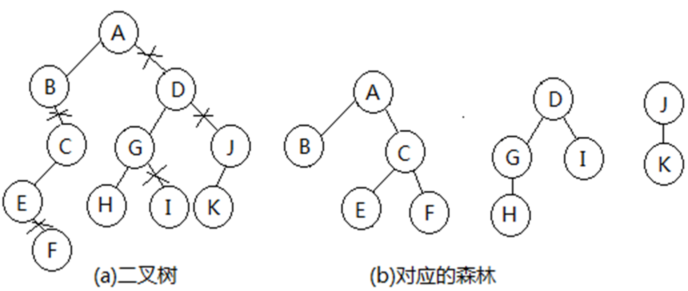
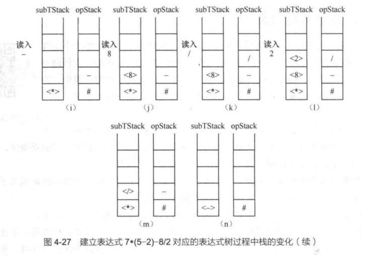

# 树

## 相关术语

1. 定义：
    * 在一个元素集合中，如果元素呈上下层次关系。对一个结点而言，上层元素为其直接前驱且直接前驱唯一，下层元素为其直接后继且直接后继可以有多个，这样的结构就是树结构。
    * 树是有限个(n>0)元素组成的集合。在这个集合中，有一个结点称为根；如果有其他的结点，这些结点又被分为若干个互不相交的非空子集，每个子集又是一棵树，称为根的子树；每个子树都有自己的根，子树的根称为树根结点的孩子结点。

2. 术语：
    * 结点的度：结点拥有的子树的个数。
    * 叶子结点：度为0的结点。
    * 结点的层次：根结点的层次为1，其余结点的层次等于其双亲结点的层次加1。
    * 树的高度：树中结点的最大层次。
    * 结点的祖先：从根到该结点所经分支上的所有结点。
    * 结点的子孙：以某结点为根的子树中的任一结点。
    * 结点的兄弟：具有相同双亲的结点。
    * 结点的堂兄弟：双亲在同一层的结点。
    * 树的度：树中结点的最大度。
    * 森林：两棵及以上的树
    * 有序树：其孩子结点都被规定了一定的顺序，如谁是第一个孩子、谁是第二个孩子等，这棵树就称有序树

## 二叉树

### 定义

二叉树是有限个(**n≥0**)结点的集合。它或者为空，或者有一个结点作为根结点，其余结点分成左右两个互不相交的子集作为根结点的左右子树，每个子树又是一棵二叉树。

注：
* 二叉树结点个数可以为0
* 二叉树左右孩子要明确指出是左还是右
* 二叉树的各种形态：


特殊二叉树：
1. 满二叉树：一棵k层二叉树中每一层结点数量都达到了最大值
2. 完全二叉树：一棵二叉树有k层，其中k-1层都是满的，第k层可能缺少一些结点，但**缺少的结点是自右向左**的

### 二叉树的性质

1. 性质1：在二叉树的第$i$层上至多有$2^{i-1}$个结点（$i≥1$）
2. 性质2：深度为$k$的二叉树至多有$2^k-1$个结点（$k≥1$）
3. 性质3：对任何一棵二叉树T，如果其叶子结点数为$n_0$，度为2的结点数为$n_2$，则$n_0=n_2+1$
4. 性质4：具有$n$个结点的**完全二叉树**的深度为$\lfloor log_2n \rfloor+1$
5. 性质5：对**完全二叉树**，若从上到下、从左到右编号，则编号为$i$的结点，其左孩子编号为$2i$，右孩子编号为$2i+1$，其双亲编号为$\lfloor i/2 \rfloor$

### 二叉树的存储结构

1. 顺序存储：
    * 用一组连续的空间即数组来存储二叉树中的结点。
    * 每个结点除了包括元素值，还包括表达二叉树父子关系的字段。可设置四个字段： data、left、right、parent，其中left、right、parent为其左、右孩子及父结点在数组中的下标。
    * 对于**完全二叉树**：对结点按照二叉树层次自上而下、自左向右进行编号，编号从0开始逐步加一，然后将结点存储在下标和其编号相同的数组分量中。那么根据性质5，结点$i$的左孩子为$2i+1$，右孩子为$2i+2$，父结点为$(i - 1)/2$。(注：这里的下标是从**0**开始的)
2. 链式存储：
    * 标准形式：每个结点有三个域，分别存放数据、左孩子指针和右孩子指针。
    * 广义标准形式：每个结点有四个域，分别存放数据、左孩子指针、右孩子指针和父节点指针。

### 二叉树的基本操作

1. 建树、计算size、计算高度、删除树
2. 遍历操作
    1. 前序遍历：根左右
        * 递归实现：先访问根结点，再前序遍历左子树，最后前序遍历右子树
        * 非递归实现：使用栈---先将根结点入栈，然后出栈并访问，再将右孩子入栈，最后将左孩子入栈(因为栈是先进后出的，所以要先将**右孩子**入栈)
        * 时间效率分析：O(n)
    2. 中序遍历：左根右
        * 递归实现：先中序遍历左子树，再访问根结点，最后中序遍历右子树
        * 非递归实现：
            * 结点在栈中的状态：
                * 0表示未考虑过左孩子
                * 1表示已经考虑过左孩子
            * 使用栈：对于栈中弹出的结点
                * 如果标志位为0，将其标志改为1并反手将该结点再次压入栈中，如果该结点有左子，随即将其左子压入栈中，并以0作为左子的标志
                * 如果标志位为1，就可以直接进行访问，如果其有右子，将右子压入栈中，并以0作为右子的标志。
        * 时间效率分析：O(n)
    3. 后序遍历：左右根
        * 递归实现：先后序遍历左子树，再后序遍历右子树，最后访问根结点
        * 非递归实现：
            * 结点在标志栈中的状态：
                * 0：表示该结点首次进栈
                * 1：表示该结点的左子树已经遍历完毕
                * 2：表示该结点的右子树已经遍历完毕
            * 使用栈：对于栈中弹出的结点
                * 如果标志位为0，将其标志改为1并反手将该结点再次压入栈中，如果该结点有左子，随即将其左子压入栈中
                * 如果标志位为1，将其标志改为2并反手将该结点再次压入栈中，如果该结点有右子，随即将其右子压入栈中
                * 如果标志位为2，就可以直接进行访问
        * 时间效率分析：O(n)
    4. 层次遍历：从上到下，从左到右
        * 使用队列：先将根结点入队，然后出队并访问，再将左孩子入队，最后将右孩子入队，重复直到队列为空
        * 时间效率分析：O(n)
3. 重构操作（即通过遍历序列确定二叉树）
    1. 特殊二叉树：
        * 完全二叉树：层次遍历
        * 满二叉树：前 / 中 / 后序遍历 之一
    2. 一般二叉树：
        * 前 + 中：
            * 实现思想：
                1. 由**前序数组**定出根结点值后，在**中序**数组找到**根结点值所在的位置**，由此找到了前序和中序序列中根的**左子树**和**右子树**的下标范围
                2. 根据根结点的值创建根结点空间，并分别利用两个数组和其左子树下标范围、右子树下标范围**递归**确定其左、右子树，将左右子树的根地址写入根结点的左右孩子指针中
                3. 图示：

                
            * 算法实现：
            ``````cpp
            template <class elemType>
            Node<elemType> *BTree<elemType>::buildTree(elemType pre[], int pl, int pr, elemType mid[], int ml, int mr)
            //pre数组存储了前序遍历序列，pl为序列左边界下标，pr为序列右边界下标。
            //min数组存储了中序遍历序列，ml为序列左边界下标，mr为序列右边界下标。
            {   
                Node<elemType> *p, *leftRoot, *rightRoot;
                int i, pos, num;
                int lpl, lpr, lml, lmr; //左子树中前序的左右边界、中序的左右边界
                int rpl, rpr, rml, rmr; //右子树中前序的左右边界、中序的左右边界
            
                if (pl>pr) return NULL;
                p = new Node<elemType>(pre[pl]); //找到子树的根并创建结点
                if (!root) root = p;
             
                //找根在中序中的位置和左子树中结点个数
                for (i=ml; i<=mr; i++)
                    if (mid[i]==pre[pl]) break;
                pos = i;    //子树根在中序中的下标
                num = pos-ml; //子树根的左子树中结点的个数
            
                //找左子树的前序、中序序列下标范围
                lpl = pl+1; lpr = pl+num;
                lml = ml; lmr = pos-1;
                leftRoot = buildTree(pre, lpl, lpr, mid, lml, lmr);
             
                //找右子树的前序、中序序列下标范围
                rpl = pl+num+1; rpr = pr;
                rml = pos+1; rmr = mr;
                rightRoot = buildTree(pre, rpl, rpr, mid, rml, rmr);
                p->left = leftRoot;
                p->right = rightRoot;
                return p;
            }
            ``````
        * 后 + 中
            1. 原来在前序中找根的任务，就交给了后序序列
            2. 两个序列在找根时方法不同，在前序序列中根位于最前面，而后序序列中根位于最后面。
        * 前 + 后：**无法确定二叉树**

## 树和森林

### 树的存储方式

1. 树存储方式：孩子兄弟表示法
    * 结点结构：
        * 数据域
        * 指向最左孩子的指针（左分支、左手）
        * 指向右侧兄弟的指针（右分支、右手）
2. 森林存储方式：
    * 每棵树按照孩子兄弟法存储后
    * 自左向右将每棵树的根视作兄弟，一个接一个地链在最小哥哥的右手上

### 树、森林和二叉树的转换

1. 树转换为二叉树：
    1. 树的根就是二叉树的根
    
    2. 对树中每个结点，保留其到最大孩子的分支，对其余孩子删除其到父结点的分支，逐个降级，增加其左侧哥哥（最小哥哥）到它的右分支，将它链到最小哥哥结点的右分支上去

    3. 图示及说明：仅保留每个结点的**最左分支**，然后删除其余分支的连接，然后将其余分支的根结点连到**左邻兄弟的右分支**
    
       
    
2. 森林转换为二叉树：
    * 每棵树按照孩子兄弟法存储后，再将每棵树的根视作兄弟，一个接一个地链在最小哥哥的右手上。
    * 图示及说明：每棵树分别转换为二叉树后，再将每棵树的根结点连到左邻兄弟的右分支上

    
    
3. 二叉树转换为树或森林
    1. 二叉树的根即为第一棵树的根
    2. 断开所有结点的右分支，然后将右分支上结点上移至连续右分支的最上层
        * 如果该上层结点有父结点，右分支结点作为该父结点的次子建立其间的分支
        * 如果该上层结点无父结点，右分支结点作为一棵新树的根结点
    3. 图示：

    

### 树的遍历

1. 先根遍历：根左右
    * 思想：访问完根结点后再逐个从左到右先根遍历其子树
    * 递归实现：
        * 如果根结点为空，遍历操作为空，否则访问根结点
        * 从左到右，逐个先根遍历以根结点的孩子为根的子树
    * 是对应二叉树的**前序遍历**
2. 后根遍历：左右根
    * 思想：逐个从左到右后根遍历其子树，最后访问根结点
    * 递归实现：
        * 如果根结点为空，遍历操作为空，否则逐个从左到右后根遍历以根结点的孩子为根的子树
        * 访问根结点
    * 是对应二叉树的**后序遍历**

### 森林的遍历

1. 先序遍历
    1. 如果森林为空，遍历操作为空
    2. 访问第一棵树的根结点
    3. 先序访问第一棵树中根节点的所有子树形成的森林
    4. 从左到右同样方式依此访问第二棵树、第三棵树...
    * 注：是对应二叉树的**前序遍历**
2. 中序遍历
    1. 如果森林为空，遍历操作为空
    2. 中序访问第一棵树中根节点的所有子树形成的森林
    3. 访问第一棵树的根结点
    4. 从左到右同样方式依此访问第二棵树、第三棵树...
    * 注：相当于从左到右对每棵树后根遍历
    * 注：是对应二叉树的**中序遍历**

### 树和森林基本操作分析

1. 如何求树的高度？
    * 利用二叉树的前序遍历，访问一个结点时，左子的层次数为父结点层次加一，右子的层次数和父结点的一样的方法来处理。
2. 求森林中树有几颗？
    * 在二叉树中顺着根，一路右子计数过去，便可解决
3. 已知一棵树的先根遍历和后根遍历，问能否唯一决定一棵树？
    * 可以，因为
        * 先根遍历--->对应二叉树的前序遍历
        * 后根遍历--->对应二叉树的中序遍历
        * 由前序和中序遍历可以唯一确定一棵二叉树，所以可以唯一确定一棵树

## 优先级队列

### 堆

1. 定义:
    1. 大顶堆: 一颗**完全二叉树**中, 任意一个结点的值比其左右子结点的值都大
    2. 小顶堆: 一颗**完全二叉树**中, 任意一个结点的值比其左右子结点的值都小
    3. 示例: 

    
2. 特点:
    1. 结构性: 一颗完全二叉树
    2. 有序性: 任意一个结点的值比其左右子结点的值都大(或小)
    * 假设节点值越小, 优先级越大, 则可利用小顶堆来表示一个优先级队列

### 优先级队列实现

1. 基本操作:
    1. 出队: 
        * 直接读取堆顶元素
        * 摘取堆顶元素后, 将堆的最后一个元素放到堆顶, 然后从堆顶开始向下调整堆, 使其成为新的小顶堆
        * 时间花费为此完全二叉树的高度, 即$O(\log_2 n)$
    
    2. 入队:
        * 将新元素放到堆的最后一个位置
        * 从新元素的父节点开始, 逐层向上调整堆:
            * 如果新结点值不小于父结点，结束检查
            * 如果新结点值小于父结点，交换两者的值，并进一步往更高层祖先检查比较，直到不小于当前父结点或无父结点为止
        * 时间花费为此完全二叉树的高度, 即$O(\log_2 n)$

    3. 示例:
    
        
    
        
    
2. 建立优先级队列
    * 建立优先级队列即建立小顶堆
    * 将存在数组中的原始序列看作是一颗完全二叉树的顺序存储
    * 按照堆的概念调整数组中的元素, 使其成为小顶堆, 调整策略为:
        1. 假设一个结点的左子树和右子树都是小顶堆，调整之，使以该结点为根的完全二叉树也是小顶堆
        2. 方法: 从**倒数第一个非叶子结点**开始, 对序列**从后往前**逐一做元素检查、调整使得**以该元素为根**的二叉树满足**小顶堆**的定义
    * 时间复杂度: $O(n)$
    
3. 代码实现
    1. 建立优先级队列
    ``````cpp
    template <class elemType>
    priorityQueue<elemType>::priorityQueue (elemType a[], int n) //建立优先级队列
    {
        if (n<1) throw illegalSize();
        array = new elemType[n+10]; //申请实际的队列存储空间，多10，支持入队
        if (!array) throw illegalSize();
        maxSize = n+10;     currentLen = n;
        for (i=1; i<=n; i++)    array[i] = a[i-1]; 
        for (i=n/2; i>=1; i--)     adjust(i);   //首次建立小顶堆, 这里的i由完全二叉树的性质可知是最后一个非叶子结点(即最后一个结点的父节点i = n/2)
    }
    ``````
    2. 调整
    ``````cpp
    template <class elemType>
    void priorityQueue<elemType>::adjust(int hole) //调整
    {
        int minChild;
        elemType tmp = array[hole];
        while (true) {
            minChild = 2*hole; // hole的左孩子
            if (minChild > currentLen) break; // hole是叶子结点
            if (minChild + 1 <= currentLen) {
                if (array[minChild+1] < array[minChild]) minChild++; // 选取左右孩子中较小的
            }
    
            if (tmp < array[minChild]) break; // hole的值比孩子小
            else {
                array[hole] = array[minChild]; // 孩子上移
                hole = minChild; // hole下移
            }
        }
    
        array[hole] = tmp; // hole的值放入最终位置
    }
    ``````
    3. 出队
    ``````cpp
    template <class elemType>
    void priorityQueue<elemType>::deQueue() //将队首元素出队
    {  if (isEmpty()) throw outOfBound();
        array[1] = array[currentLen];   currentLen--;
        adjust(1);
    }
    ``````
    4. 入队
    ``````cpp
    template <class elemType>
    void priorityQueue<elemType>::enQueue(const elemType &x)  //将x进队
    {  if (isFull()) throw outOfBound();
        int hole = ++currentLen;
        for (; hole>1 && x<array[hole/2]; hole/=2) array[hole] = array[hole/2];
        array[hole] = x;
    }//比较次数最多为二叉树高度，故入队时间效率为O(log_2⁡ 𝑛)
    ``````

## 最优二叉树

### 定义

1. 二叉树的路径长度：从根结点到每个结点的路径长度之和
2. 加权路径长度: 特指从根结点到各个**叶子结点**路径上的分支数乘以该叶子的权值之和
3. 最优二叉树: 使得加权路径长度最小的二叉树

### 哈夫曼算法

1. 基本思想: 权值越大的结点越靠近根结点
2. 具体步骤: 对于一个给定的带权节点集合U
    1. 如果U中只有一个结点, 操作结束
    2. 在集合中选取两个权值最小的结点x、y，构造一个新的结点z。新结点z的权值为结点x、y的权值之和。在集合U中删除结点x和y并加入新结点z，然后转向1
3. 示例:

    
4. 实现:
    1. 存储: 顺序存储法, 用一个数组存储哈夫曼结点
    2. 哈夫曼结点: 包含5个字段
        1. data: 结点的值
        2. weight: 结点的权值
        3. parent: 结点的父结点在数组中的下标
        4. left: 结点的左孩子在数组中的下标
        5. right: 结点的右孩子在数组中的下标
        * 特别的, 数组的0下表不存储结点, 从1开始存储
    3. 实现:
        1. 按照完全二叉树的性质, 最优二叉树叶子结点数为n, 则总结点数为2n-1, 为数组分配2n的空间
        2. 初始化: 将叶子结点存入数组, 其parent、left、right均为0, 并且叶子结点在数组中从后往前依次存储，前面空余的n-1个数组分量作为存储即将构造的中间结点用
5. 代码
``````cpp
template <class elemType>
int minIndex(HuffmanNode<elemType> Bt[], int k, int m)
{   int i, min, minWeight = 9999;//用一个不可能且很大的权值
 
   for (i=m-1; i>k; i--)
    {   if ((Bt[i].parent==0)&&(Bt[i].weight < minWeight))
        {   min = i;     minWeight = Bt[min].weight;     }
    }
    return min;  
 }

template <class elemType>
HuffmanNode<elemType> *BestBinaryTree ( elemType a[], 
double w[], int n)
{
    HuffmanNode<elemType> *BBTree;
    int first_min, second_min; //
    int m=n*2; //共2n-1个结点，下标为0处不放结点
    int i, j;
    BBTree = new HuffmanNode<elemType>[m];
    for (j=0; j<n; j++)
    {   i = m-1-j;
        BBTree[i].data = a[j];
        BBTree[i].weight = w[j];
        BBTree[i].parent = 0;
        BBTree[i].left = 0;
        BBTree[i].right = 0;
    }
    i = n-1; // i is the position which is ready for the first new node

    while (i!=0) //数组左侧尚有未用空间，即新创建的结点个数还不足
    {   first_min = minIndex(BBTree, i, m);  BBTree[first_min].parent = i;
        second_min = minIndex(BBTree, i, m);  BBTree[second_min].parent = i;
 
        BBTree[i].weight = BBTree[first_min].weight 
                                     + BBTree[second_min].weight;
        BBTree[i].parent = 0;
        BBTree[i].left = first_min; BBTree[i].right = second_min;
        i--;
    }
      return BBTree;
}
``````
6. 时间复杂度: $O(n^2)$

### 哈夫曼编码

1. 前缀码：任何一个字符的编码都不是另一个字符编码的前缀
2. 哈夫曼编码：对于一颗哈夫曼树，做如下操作：
    1. 凡是左分支都标上 0、右分支都标上 1
    2. 从根结点到叶子结点的路径上的 0、1 序列即为该叶子结点的编码，这个编码就是哈夫曼编码
    * 哈夫曼编码是一种前缀码
3. 求哈夫曼编码：
    1. 将某叶子结点设为当前结点，顺着当前结点往上追溯到父亲结点
    2. 如果当前结点是父亲的左孩子就输出一个 0, 如果当前结点是父亲的右孩子就输出一个 1
    3. 再设父亲为当前结点，反复进行以上操作，直到当前结点为根结点
    4. 这个过程中输出的 0、1 序列的逆序即为该叶子结点的哈夫曼编码
    * 哈夫曼编码最长为 n-1
4. 代码实现：使用的数据结构是栈
``````cpp
template <class elemType>
char ** HuffmanCode ( HuffmanNode<elemType> BBTree[], int n )
//n为待编码元素的个数，BBTree数组为Huffman树，数组长度为2n
{
    seqStack<char> s;
    char **HFCode;
    char zero = '0', one = '1';
    int m, i, j, parent, child;
 
    //为HFCode创建空间
    HFCode = new char* [n];
    for (i=0; i<n; i++)
        HFCode[i] = new char[n+1]; //每位元素编码最长n-1位，+1为n=1时储备

    m=2*n; //BBTree数组长度
    if (n==0) return HFCode; //没有元素
    if (n==1) //元素个数为1
    {
        HFCode[0][0] = '0', HFCode[0][1] = '\0';
        return HFCode;
    }
    // 从最后一个叶子结点开始，逐个求编码
    for (i=m-1; i>=n; i--)
    {
        child=i;
        parent = BBTree[child].parent;
        while (parent!=0)
        {
            if (BBTree[parent].left==child)
                s.push(zero);
            else
                s.push(one);
            child = parent;
            parent = BBTree[parent].parent;
        }
        // 栈中的0、1序列逆序存入HFCode
        j=0;
        while (!s.isEmpty())
        {
            HFCode[m-i-1][j] = s.top();
            s.pop();
            j++;
        }
        HFCode[m-i-1][j] = '\0';
 
    }
    return HFCode;
}
``````
5. 时间复杂度: 最好为$O(n\log_2 n)$, 最坏为$O(n^2)$

## 表达式树

**定义**：用二叉树表示的表达式称为表达式树。

**构建**：按照计算顺序，操作符作为根，操作数1作为左子，操作数2作为右子

1. 图示：表达式7*(5-2)-8/2构建表达式树的过程：

    

2. **算法**：用一个操作符栈和一个子树栈

    1. 如果读入的是数字，创建一个结点，把结点当作子树的根，且将其地址压入子树栈

    2. 如果读入的是左括号，直接将它压入操作符栈；如果读入的是右括号，反复弹操作符栈，直到弹出的是左括号为止

    3. 如果读入的是四则运算操作符之一，反复和操作符栈顶元素比优先级，不比栈顶操作符优先级高时，将操作符栈顶元素弹出，直到栈顶元素优先级比读入的操作符低时，将读入的操作符压栈

    4. 每弹出一个操作符（除左括号），将它作为结点data，创建一个新的结点，之后从子树栈中弹出两个元素即两个子树的根作为新结点的左右子，最后将新结点地址作为新构成的子树的根地址压入子树栈

    5. 表达式字符串全部读入后，继续将操作符栈中操作符弹出，将它作为结点data，创建新的结点，两次弹子树栈，作为新结点左右子，新结点地址继续压入子树栈，反复弹操作符栈并进行如上操作，直到栈空

    6. 子树栈中仅有的一个结点地址就是表达式树的根结点地址

    * 示例：

        

        

**计算**：

1. 可以用一个**操作数栈**，然后根据**后序遍历**“左右根”的思路完成。

2. 后序遍历中，当访问到数字时，将它压入操作数栈；当访问到操作符时，两次弹出操作数栈作为操作数进行对应的运算，结果压入操作数栈。

3. 反复如此，直到表达式树后序遍历完毕。

* 示例：

    

## 等价关系

**定义**：假设有一个集合S上的关系R， $∀x_1,x_2∈S$， 有x1Rx2为**真或者假**，则称R是集合S上的等价关系，等价关系满足：

1. 自反性：$∀x∈S, xRx$

2. 对称性：$∀x_1,x_2∈S, 若x_1Rx_2, 则x_2Rx_1$

3. 传递性：$∀x_1,x_2,x_3∈S, 若x_1Rx_2, x_2Rx_3, 则x_1Rx_3$

**等价类**：∀x1∈S，其所属**等价类**是集合S的一个子集S1。这个子集有这样的特点：∀x1、x2∈S1，必有**x1Rx2**为真。

**不相交集**：集合S的所有等价类形成了集合A={𝑠1,𝑠2,…𝑠𝑚}，显然有$∀si∈A, si≠∅,∀si、 sj∈A, si∩sj=∅, ⋃_{𝑖=1}^𝑚𝑠𝑖=𝑆$，因此集合A是对集合S的一个划分。划分中的每个子集即集合A中的各个元素，它们称为不相交集。

**并查集**：不相交集的基本操作分为合并和查找， 故不相交集又称为并查集(union-find sets)

1. 合并：是对两个不相交集进行合并，使之成为一个新的、更大的不相交集。当分属于两个不相交集的元素间添加了等价关系，根据传递性，也要合并这两个不相交集

    * 特别地：当有元素x插入时，可以通过把单个元素x视作由它自己构成了一个新的不相交集，让新的不相交集和某个已有的不相交集合并，就完成了插入操作

2. 查找：是对集合S中的元素x找到它所属的不相交集，这里即给出不相交集的标志

**不相交集**的**存储**：

1. **顺序存储**：可以将集合S中的所有元素放置在同一个数组中，数组中的每个分量除了存储元素还要存储元素所属的不相交集的标志，比如：

    

2. **树形存储**：将集合S中的所有元素放置在同一个数组中，而数组中的每个分量除了存储元素，还要存储元素的父结点下标，这种存储方式称双亲表示法，它是一种树形存储

    * 当某个元素的父结点下标为-1，这个元素就是树根

    * 每个不相交集用一棵树来表示，然后用树根下标表示所属不相交集的标志。

    * 集合中的任何一个元素沿着父结点字段都可以追溯到根，找到所属的不相交集合的标志。

    * 代表不同不相交集的树组成一片森林

    * 示例：

        
    
**不相交集的基本操作**：

1. **查找**：对于一个元素只需要沿着这棵树向上找到树根，**得到树根的下标**，就完成了查找任务。时间花费是这棵树的高度。显然树的高度越低越好，最低时一个不相交集可以退化为两层，一个元素作为树根，其余元素作为树根的儿子结点。

    * 优化：采取越近期访问过的结点越往根结点靠的原则——**路径压缩法**

        * 查找时，会沿着查找结点到根一路访问过去。这条查找结点到根结点路径上所有的结点（但不含根结点）全部改为根结点的儿子结点

    * 示例：查找1后，路径压缩

          

2. **合并**：当a，b两个不相交集要合并时，可以将b中所有元素都当作a的根结点的儿子，但时间花费和b中元素个数相关。如果简单地把b的根作为a的根结点的儿子，时间花费是常量阶的

    * 优化：按照两个树的高度或者结点规模来判别

        * 按高度时，将高度小的树并入高度大的树，以高度大的树的根结点作为合并后的树根。这样可以尽量阻止合并后树的高度增加，查找就会因树的高度不增而提高效率。当然，当两个树高度一致时，合并后树高必然增加1。

        * 按结点规模时，将规模小的树并入规模大的树。这种方法，可使合并后 层次号增加1的结点个数量达到最少。从而达到降低后面平均查找时间的目的。

        * 为方便合并，根结点的父结点不再使用-1，可以用高度或者规模的负数来表示

    * 示例：
    
        